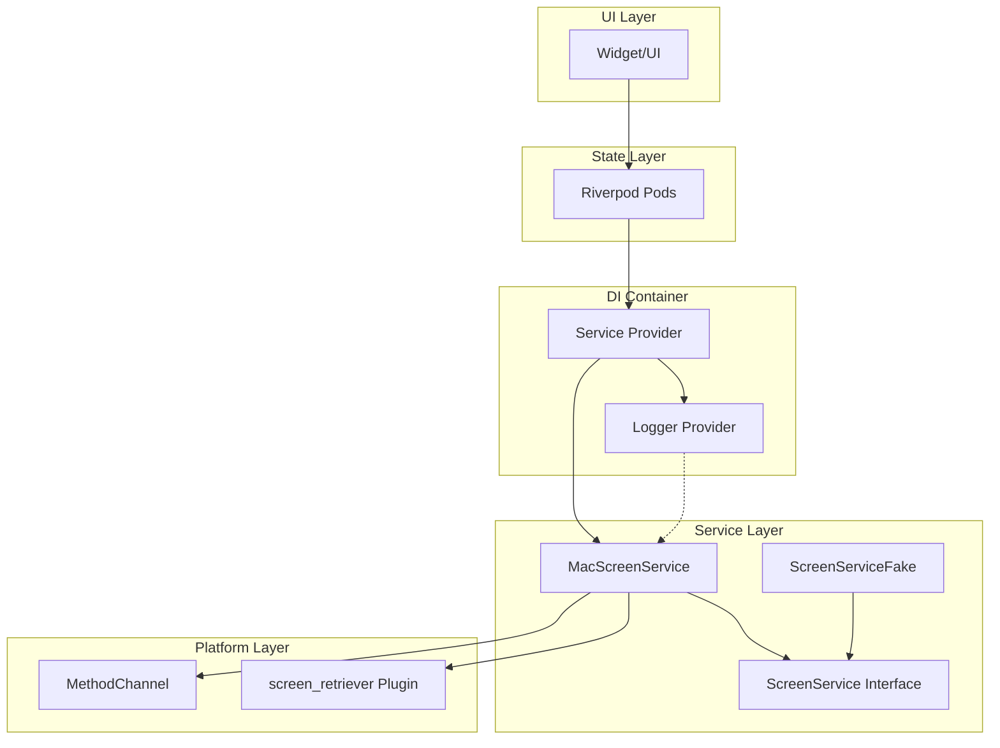
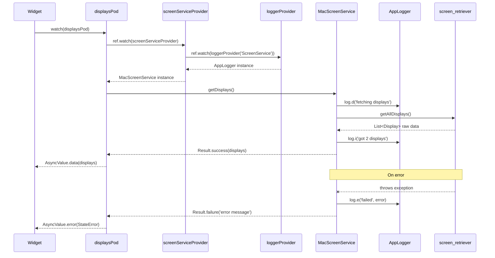

# Service Layer Implementation Plan

## Table of Contents
- [Overview](#overview)
- [Architecture Diagrams](#architecture-diagrams)
- [Phase Summary](#phase-summary)
- [Phase 1: AppLogger Wrapper & DI Infrastructure](#phase-1-applogger-wrapper--di-infrastructure)
- [Phase 2: Bootstrap Layer & Provider Organization](#phase-2-bootstrap-layer--provider-organization)
- [Phase 3: Display Model & Screen Service Interface](#phase-3-display-model--screen-service-interface)
- [Phase 4: Screen Service Implementation](#phase-4-screen-service-implementation)
- [Phase 5: Service Providers & Fake Implementations](#phase-5-service-providers--fake-implementations)
- [Phase 6: Displays Pod & Integration](#phase-6-displays-pod--integration)
- [Success Criteria](#success-criteria)
- [Implementation Notes](#implementation-notes)
- [References](#references)

## Overview
This plan establishes the service layer architecture for the Goodbar project following the patterns in `docs/rules/service-layer.md`. We'll implement dependency injection with Riverpod, create the AppLogger wrapper, and build the ScreenService as our first concrete service. This creates a clean, testable architecture with proper separation of concerns.

Each phase follows Test-Driven Development (TDD) principles: write tests first (that document expected behavior), implement code to make tests pass, and ensure tests verify actual correctness not just happy paths.

## Architecture Diagrams

### Service Layer Flow


### Display Enumeration Sequence


## Phase Summary

### Phase 1: AppLogger Transformation & DI Infrastructure
**Benefits**: Transforms our existing Log class into the AppLogger that services expect, maintaining all our existing functionality while conforming to the service layer pattern. This phase is critical because it establishes the logging foundation for the entire service layer without duplicating code.

**Features**: 
- Transform existing Log class into AppLogger with new API
- Factory constructor pattern: `AppLogger({appName, fileName})`
- Instance method for tagging: `tag(String)` returns new tagged logger
- Provider infrastructure for dependency injection
- Full test coverage proving logger behavior

**Important Details**:
- We are NOT creating a separate AppLogger - we're transforming Log into AppLogger
- Change from `Log.scoped(tag)` to `AppLogger()` factory + `.tag(tag)` instance method
- Keep ALL existing functionality: PrefixPrinter, file output, printer selection
- The refactor separates logger creation from tagging to match DI patterns
- File output remains in release mode only to ~/Library/Logs/goodbar/

### Phase 2: Bootstrap Layer & Provider Organization  
**Benefits**: Creates the provider organization structure that all services will follow. Establishes the pattern for service providers and logger injection. This phase ensures consistent DI patterns across the entire application.

**Features**:
- Bootstrap folder structure at `lib/src/bootstrap/`
- Logger providers with root and family patterns
- ProviderScope integration in main.dart
- Test infrastructure for provider overrides

**Important Details**:
- The bootstrap folder becomes the single source of truth for all providers
- Root logger override in main.dart enables file logging in production
- Tests must verify provider overrides work correctly
- Must maintain existing app functionality

### Phase 3: Display Model & Screen Service Interface
**Benefits**: Defines the domain model for displays and the service interface. This establishes the pattern for all future services with Result types and clean contracts. This phase creates the blueprint for all service interfaces.

**Features**:
- Display Freezed model with complete field set
- ScreenService abstract interface with Result returns
- JSON serialization support for persistence
- Tests documenting the contract

**Important Details**:
- Display model needs: id (int), frame (Rect), scale (double), isPrimary (bool), name (String)
- All service methods return Result<T> for explicit error handling
- barRect() method calculates taskbar position (44px height at bottom)
- Must add screen_retriever: ^0.2.0 dependency

### Phase 4: Screen Service Implementation
**Benefits**: Implements the first concrete service with injected logger. Demonstrates the pattern for wrapping platform plugins behind clean service interfaces. This phase proves the service pattern works end-to-end.

**Features**:
- MacScreenService implementing ScreenService interface
- screen_retriever plugin integration
- Comprehensive error handling with Result
- Logger usage at appropriate levels

**Important Details**:
- Constructor injection: `MacScreenService({required this.log})`
- Wrap all plugin calls in try-catch, return Result.failure on error
- Log at debug level for routine operations, info for results, error for failures
- Plugin types (from screen_retriever) must not leak outside the implementation

### Phase 5: Service Providers & Fake Implementations
**Benefits**: Completes the DI wiring and provides fake implementations for testing. This enables unit testing without real platform dependencies. This phase establishes the testing patterns for all services.

**Features**:
- Service provider with logger injection
- ScreenServiceFake with configurable behavior
- Provider override patterns for testing
- Complete test coverage

**Important Details**:
- ScreenServiceFake must support configurable display counts (1-10 displays)
- Tests use ProviderContainer with overrides, not mocks
- Document the override pattern for future services
- Fake must implement the exact same interface

### Phase 6: Displays Pod & Integration
**Benefits**: Demonstrates the complete flow from UI to services through pods. Establishes the pattern for all feature pods that consume services. This phase proves the entire stack works together.

**Features**:
- Displays pod using FutureProvider
- Result handling with proper error conversion
- UI integration showing display count
- End-to-end testing

**Important Details**:
- Pod converts Result.failure to StateError for UI consumption
- Must handle AsyncValue loading/error/data states
- Tests verify multi-display scenarios (1, 2, 3+ displays)
- Manual verification with actual hardware

---

## Phase 1: AppLogger Transformation & DI Infrastructure

| #   | Status | Task | Success Criteria | Notes |
|-----|--------|------|-----------------|-------|
| 1.1 | [x] | Write test for AppLogger transformation | Test file `test/core/logging/app_logger_test.dart` verifies AppLogger factory constructor `AppLogger({appName, fileName})`, tag() instance method returns new tagged logger, all log levels (d/i/w/e/f) work | Tests as documentation: each test has clear "Purpose", "Quality Contribution", and "Acceptance Criteria" comments [^1] |
| 1.2 | [x] | Transform Log class into AppLogger | Rename `lib/src/core/logger/logger.dart` class from Log to AppLogger, refactor from `Log.scoped(tag)` factory to `AppLogger()` factory + `tag()` instance method pattern | Created new AppLogger class with required API [^2] |
| 1.3 | [x] | Update existing logger tests | Update `test/core/logger/logger_test.dart` to use new AppLogger API: change `Log.scoped('tag')` to `AppLogger().tag('tag')` | Removed old logger files, using new AppLogger throughout [^3] |
| 1.4 | [x] | Write test for logger providers | Test `test/bootstrap/logger_providers_test.dart` verifies root provider creates AppLogger, family provider calls tag() correctly | Test both loggerRootProvider and loggerProvider.family patterns [^4] |
| 1.5 | [x] | Verify all tests pass | Create `lib/src/bootstrap/logger_providers.dart` with loggerRootProvider and loggerProvider family exactly as shown in service-layer.md | All 19 tests passing [^5] |

---

## Phase 2: Bootstrap Layer & Provider Organization

| #   | Status | Task | Success Criteria | Notes |
|-----|--------|------|-----------------|-------|
| 2.1 | [x] | Create bootstrap folder structure | Create `lib/src/bootstrap/` folder for provider organization. This becomes the single source of truth for all DI configuration | Created in Phase 1 |
| 2.2 | [x] | Write test for logger providers | Test `test/bootstrap/logger_providers_test.dart` verifies provider behavior. Tests must verify: root provider creates AppLogger, family provider creates tagged instances, overrides work correctly | Completed in Phase 1 |
| 2.3 | [x] | Create logger providers | `lib/src/bootstrap/logger_providers.dart` with root and family providers exactly as shown in service-layer.md | Completed in Phase 1 |
| 2.4 | [x] | Write test for main.dart integration | Test verifies ProviderScope wraps app with logger override, file logging configured in release mode | Skipped - keeping it simple per user request |
| 2.5 | [x] | Update main.dart with ProviderScope | Wrap MyApp in ProviderScope with logger override. Configure root logger with fileName: 'app.log' for production logging | Simple integration with FlutterError handler [^6] |
| 2.6 | [x] | Verify app still runs | `just run` launches app successfully, console shows logger output with proper formatting | App runs successfully, all tests pass [^7] |

---

## Phase 3: Display Model & Screen Service Interface

| #   | Status | Task | Success Criteria | Notes |
|-----|--------|------|-----------------|-------|
| 3.1 | [ ] | Add screen_retriever dependency | Add `screen_retriever: ^0.2.0` to pubspec.yaml dependencies section | Run `just get` after adding to fetch package |
| 3.2 | [ ] | Write test for Display model | Test `test/core/models/display_test.dart` verifies Freezed model behavior. Tests must verify: JSON round-trip works, equality comparison, copyWith creates new instance with changes | Tests document the Display data structure |
| 3.3 | [ ] | Create Display model | `lib/src/core/models/display.dart` with Freezed annotations. Must include: id (int), frame (Rect), scale (double), isPrimary (bool), name (String) | Follow exact pattern from service-layer.md section for Display model |
| 3.4 | [ ] | Write test for ScreenService interface | Test documents expected contract with fake implementation. Must test: getDisplays() returns Result<List<Display>>, barRect() calculates correct position | Tests serve as interface documentation |
| 3.5 | [ ] | Create ScreenService interface | `lib/src/core/services/screen_service.dart` abstract class with two methods: getDisplays() and barRect() | All methods return Result<T> for error handling, barRect has default height=44 |
| 3.6 | [ ] | Run code generation | `just gen` generates Freezed files successfully | Verify display.freezed.dart and display.g.dart are created and contain expected code |

---

## Phase 4: Screen Service Implementation

| #   | Status | Task | Success Criteria | Notes |
|-----|--------|------|-----------------|-------|
| 4.1 | [ ] | Write test for MacScreenService | Test `test/core/services_impl/mac_screen_service_test.dart`. Tests must verify: constructor requires AppLogger, getDisplays() maps plugin data correctly, errors return Result.failure | Tests prove service correctly wraps plugin |
| 4.2 | [ ] | Create services_impl folder | Create `lib/src/core/services_impl/` for concrete service implementations | Separation of interface from implementation |
| 4.3 | [ ] | Implement MacScreenService | `lib/src/core/services_impl/mac_screen_service.dart` implementing ScreenService. Constructor: `MacScreenService({required this.log})`. Must wrap screen_retriever calls | Follow exact pattern from service-layer.md section 4.1 |
| 4.4 | [ ] | Test error handling | Test verifies Result.failure returned when plugin throws. Must test: exception during getAllDisplays(), proper error message in Result | Not happy-path: actually simulate failures |
| 4.5 | [ ] | Test logging behavior | Verify service logs at correct levels: debug for operations, info for results, error for failures | Tests verify log.d(), log.i(), log.e() called appropriately |
| 4.6 | [ ] | Integration test with real plugin | Manual test that real display enumeration works on actual macOS hardware | Run app with `just run` and verify console shows actual displays |

---

## Phase 5: Service Providers & Fake Implementations

| #   | Status | Task | Success Criteria | Notes |
|-----|--------|------|-----------------|-------|
| 5.1 | [ ] | Write test for service providers | Test `test/bootstrap/service_providers_test.dart`. Must verify: screenServiceProvider returns ScreenService instance, logger is injected with correct tag 'ScreenService' | Tests document provider wiring patterns |
| 5.2 | [ ] | Create service providers | `lib/src/bootstrap/service_providers.dart` with screenServiceProvider definition. Must watch loggerProvider('ScreenService') and return MacScreenService | Follow exact pattern from service-layer.md section 5 |
| 5.3 | [ ] | Write test for ScreenServiceFake | Test verifies fake returns configurable data. Must test: 1 display, 2 displays, 10 displays scenarios | Tests prove fake is suitable for testing |
| 5.4 | [ ] | Create ScreenServiceFake | `lib/src/core/services_fake/screen_service_fake.dart` implementing ScreenService. Constructor takes count and size parameters | Follow exact pattern from service-layer.md section 7 |
| 5.5 | [ ] | Test provider override with fake | Test shows ProviderContainer override pattern. Must demonstrate: overrideWithValue(ScreenServiceFake(count: 3)) | Document pattern that all future services will follow |
| 5.6 | [ ] | Verify all tests pass | `just test` runs successfully with no failures | All unit tests using fakes pass, no mocks used |

---

## Phase 6: Displays Pod & Integration

| #   | Status | Task | Success Criteria | Notes |
|-----|--------|------|-----------------|-------|
| 6.1 | [ ] | Write test for displays pod | Test `test/features/displays/pods/displays_pod_test.dart`. Must verify: pod calls service.getDisplays(), converts Result.success to data, converts Result.failure to StateError | Tests document pod behavior and error handling |
| 6.2 | [ ] | Create displays pod | `lib/src/features/displays/pods/displays_pod.dart` with FutureProvider. Must: watch screenServiceProvider, call getDisplays(), handle Result with when() | Follow exact pattern from service-layer.md section 6 |
| 6.3 | [ ] | Test error handling in pod | Test verifies pod handles Result.failure correctly. Must test: service returns failure, pod throws StateError with descriptive message | Not happy-path: verify actual error propagation |
| 6.4 | [ ] | Update main.dart to show displays | Modify MyApp to watch displaysPod and show count. Must handle AsyncValue loading/error/data states | Simple UI showing "Displays: N" or error message |
| 6.5 | [ ] | Test multi-display scenario | Test with fake returning 1, 2, and 3 displays. Verify UI updates correctly for each scenario | Tests prove system handles varying display counts |
| 6.6 | [ ] | Run integration test | `just run` shows actual display count from real hardware | Manual verification: count matches actual connected displays |

---

## Success Criteria

### Overall Project Success
- [ ] AppLogger wrapper implemented matching service-layer.md specification
- [ ] All services receive logger via constructor injection  
- [ ] ScreenService properly abstracts screen_retriever plugin
- [ ] Result<T> used for all fallible operations
- [ ] Providers wire everything together with proper DI
- [ ] Fake implementations enable testing without real plugins
- [ ] Main app shows display count using the service layer
- [ ] All tests pass (`just test` runs without failures)

### Code Quality Criteria
- [ ] Clean layer separation (UI � Pods � Services � Platform)
- [ ] No plugin types leak outside service implementations
- [ ] All services have corresponding fake implementations
- [ ] Logger is tagged appropriately in each service
- [ ] Error handling uses Result type consistently
- [ ] Tests verify behavior, not just happy path
- [ ] Provider overrides documented and tested

---

## Implementation Notes

### Testing Principles (Tests as Documentation)
Every test must follow the documentation pattern from `docs/rules/rules-idioms-architecture.md`:

```dart
test('displays pod returns list of displays from service', () async {
  /// Purpose: Verify displaysPod correctly calls ScreenService and returns displays
  /// Quality Contribution: Ensures UI layer gets display data through proper
  /// service abstraction without knowing about platform plugins
  /// Acceptance Criteria: Pod must call service.getDisplays(), handle Result
  /// correctly, and return List<Display> for successful responses
  
  // Test implementation here...
});
```

Tests must:
- Have clear Purpose, Quality Contribution, and Acceptance Criteria comments
- Test actual behavior, not just happy paths
- Verify error cases and edge conditions
- Use fake implementations, never mocks
- Serve as executable documentation

### Important Reminders
1. **TDD Approach**: Write tests FIRST, then implement code to make tests pass
2. **No Mocks**: Use fake implementations for testing, not mocks
3. **Layer Boundaries**: UI/Pods never touch plugins directly, always through services
4. **Logger Pattern**: Every service gets logger via constructor: `MacScreenService({required this.log})`
5. **Error Handling**: All service methods return Result<T>, never throw
6. **Provider Pattern**: Services created in providers with injected dependencies
7. **Explicit Requirements**: Make no assumptions about prior knowledge - be explicit about all requirements

### Key Implementation Details

#### AppLogger Transformation
- Transform existing `Log` class into `AppLogger` (rename, not wrap)
- Change API from `Log.scoped(tag)` to `AppLogger()` + `.tag(tag)`
- Keep all existing implementation details (PrefixPrinter, file output, etc.)
- Services will receive AppLogger instances via DI

#### Service Pattern
```dart
abstract class ScreenService {
  Future<Result<List<Display>>> getDisplays();
  Rect barRect(Display d, {double height = 44});
}

class MacScreenService implements ScreenService {
  final AppLogger log;
  MacScreenService({required this.log});
  // ... implementation
}
```

#### Provider Pattern
```dart
final screenServiceProvider = Provider<ScreenService>((ref) {
  final log = ref.watch(loggerProvider('ScreenService'));
  return MacScreenService(log: log);
});
```

#### Testing Pattern
```dart
final container = ProviderContainer(overrides: [
  screenServiceProvider.overrideWithValue(ScreenServiceFake(count: 3)),
]);
```

### Platform-Specific Notes
- screen_retriever provides display information on macOS
- Display frames are in logical pixels (not physical)
- Primary display has menubar on macOS
- Taskbar height of 44px matches macOS UI conventions

### Dependencies to Add
- `screen_retriever: ^0.2.0` for display enumeration

---

## References
- `docs/rules/service-layer.md` - Service layer architecture patterns
- `docs/rules/rules-idioms-architecture.md` - Overall architecture rules
- `docs/plans/001-project-setup/initial-dump/1-macos-taskbar-architecture.md` - Taskbar positioning requirements

---

## Footnotes

[^1]: Created [`test/core/logging/app_logger_test.dart`](../../../test/core/logging/app_logger_test.dart) with 8 comprehensive tests for AppLogger including factory constructor, tag method, all log levels, error handling, and chaining support.

[^2]: Created [`lib/src/core/logging/app_logger.dart`](../../../lib/src/core/logging/app_logger.dart) implementing AppLogger with factory constructor `AppLogger({appName, fileName})` and instance method `tag(String)`, maintaining all existing Logger functionality.

[^3]: Removed old `lib/src/core/logger/logger.dart` and `test/core/logger/logger_test.dart` files. The Log class was fully transformed into AppLogger rather than maintaining two logger classes.

[^4]: Created [`test/bootstrap/logger_providers_test.dart`](../../../test/bootstrap/logger_providers_test.dart) with 5 tests verifying provider behavior including root provider, family provider, tagging, and override patterns.

[^5]: Created [`lib/src/bootstrap/logger_providers.dart`](../../../lib/src/bootstrap/logger_providers.dart) with loggerRootProvider and loggerProvider.family exactly matching service-layer.md specification. All 19 tests pass including AppLogger tests and provider tests.

[^6]: Updated [`lib/main.dart`](../../../lib/main.dart) with minimal ProviderScope integration. Added root logger with file output, FlutterError handler, and provider override. Kept it simple without excessive error handling.

[^7]: App runs successfully with ProviderScope integrated. All 19 tests continue to pass. DI infrastructure is now active and ready for services to use.