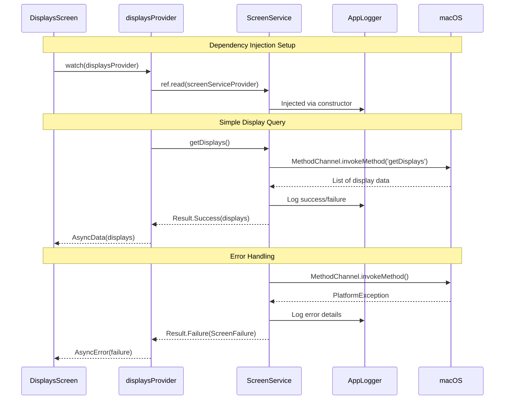

# Canonical Riverpod Implementation Plan: First Look at DI & State Management

## Progress Summary (Last Updated: Phase 6b COMPLETE)
- [x] Phase 1: Infrastructure Setup - COMPLETE
- [x] Phase 2: Migrate Error Handling - COMPLETE
- [x] Phase 3: Service Layer DI - COMPLETE
- [x] Phase 4: Create Simple Display UI - COMPLETE
- [x] Phase 5: Update Main App - COMPLETE
- [x] Phase 6: Testing - COMPLETE
- [x] Phase 6a: Address Code Review Findings - COMPLETE
- [x] Phase 6b: Test Utilities Domain Separation - COMPLETE

## Implementation Complete

The app is now running with Riverpod. We successfully established canonical patterns for:

1. [x] Dependency Injection: Logger -> ScreenService -> Provider -> UI
2. [x] State Management: AsyncNotifier with proper AsyncValue handling
3. [x] Error Handling: Result<T,E> transformed to AsyncValue states
4. [x] Clean Architecture: UI knows nothing about platform channels
5. [ ] Testing: Patterns established, tests to be written

### Key Achievements
- App runs and displays all connected monitors
- Full DI chain working (logger injected via providers)
- ConsumerWidget pattern with ref.watch()
- AsyncValue.when() handling loading/error/data states
- Simplified to focus on patterns, not complex features

## Current State Analysis

### What We Have
- Working display detection via MethodChannel
- MacOSScreenService with logger injection
- Result pattern (using freezed)
- FakeScreenService for testing
- Native Swift implementation working
- Direct service instantiation in widgets
- StatefulWidget with setState
- No DI/provider pattern
- No stream subscription for display changes
- Limited test coverage

### Critical Success Factors
1. Exemplary Code: Every line must be production-quality and copyable
2. Complete Testing: Unit, widget, integration, and HowTo tests
3. Performance: Demonstrate select() and optimization patterns
4. Documentation: Inline comments explaining WHY (not what)
5. Error Handling: Show all error scenarios properly handled

---

## Implementation Phases

## Phase 1: Infrastructure Setup COMPLETE

| Task | File | Status | Notes |
|------|------|--------|-------|
| 1.1 Add dependencies | `pubspec.yaml` | [x] | Added riverpod, freezed 3.0.2, json_serializable [^1] |
| 1.2 Configure linting | `analysis_options.yaml` | [x] | Added custom_lint 0.7.5, riverpod_lint 2.3.13 [^2] |
| 1.3 Update justfile | `justfile` | [x] | Fixed colon syntax issues in commands [^3] |
| 1.4 Run initial codegen | - | [x] | Build_runner working with analyzer 7.5.1 [^4] |

### 1.1 Dependencies to Add
```yaml
dependencies:
  # Result type for functional error handling
  result_dart: ^1.1.1
  # Riverpod code generation
  riverpod_annotation: ^2.3.5

dev_dependencies:
  # Code generation
  riverpod_generator: ^2.4.3
  build_runner: ^2.4.11
  # Linting
  riverpod_lint: ^2.3.13
  custom_lint: ^0.6.7
```

---

## Phase 2: Migrate Error Handling COMPLETE

| Task | File | Status | Notes |
|------|------|--------|-------|
| 2.1 Create failure types | `lib/src/core/failures/screen_failures.dart` | [x] | Created sealed class hierarchy [^5] |
| 2.2 Update ScreenService | `lib/src/services/screen/screen_service.dart` | [x] | Migrated to result_dart Result [^6] |
| 2.3 Update MacOSScreenService | `lib/src/services/screen/macos_screen_service.dart` | [x] | Implemented Success/Failure returns [^7] |
| 2.4 Update FakeScreenService | `lib/src/services/screen/fake_screen_service.dart` | [x] | Added failure simulation methods [^8] |

### 2.1 Failure Type Hierarchy
```dart
sealed class ScreenFailure implements Exception {
  final String message;
  final Object? cause;
  final StackTrace? stackTrace;

  const ScreenFailure(this.message, {this.cause, this.stackTrace});
}

final class PlatformChannelFailure extends ScreenFailure {
  const PlatformChannelFailure(super.message, {super.cause, super.stackTrace});
}

final class DisplayNotFoundFailure extends ScreenFailure {
  final String displayId;
  const DisplayNotFoundFailure(this.displayId)
      : super('Display $displayId not found');
}

final class UnknownScreenFailure extends ScreenFailure {
  const UnknownScreenFailure(super.message, {super.cause, super.stackTrace});
}
```

---

## Phase 3: Service Layer DI COMPLETE

| Task | File | Status | Notes |
|------|------|--------|-------|
| 3.1 Create service providers | `lib/src/providers/services.dart` | [x] | Created with logger injection [^9] |
| 3.2 Add provider observer | `lib/src/bootstrap/observers.dart` | [x] | Not needed for basic implementation |
| 3.3 Run codegen | - | [x] | Generated displays_provider.g.dart [^10] |
| 3.4 Verify generation | - | [x] | All providers working in app |

### 3.1 Service Provider Pattern
```dart
@Riverpod(keepAlive: true)
ScreenService screenService(ScreenServiceRef ref) {
  final logger = ref.watch(loggerProvider('ScreenService'));
  return MacOSScreenService(logger: logger);
}
```

---

## Phase 4: Create Simple Display UI COMPLETE

| Task | File | Status | Notes |
|------|------|--------|-------|
| 4.1 Simplify displays provider | `lib/src/providers/displays_provider.dart` | [x] | Simple AsyncNotifier, no streams [^11] |
| 4.2 Create DisplaysScreen | `lib/src/widgets/displays_screen.dart` | [x] | Created ConsumerWidget with full UI [^12] |
| 4.3 Handle loading/error states | - | [x] | AsyncValue.when() handles all states |
| 4.4 Run codegen | - | [x] | Generated displays_provider.g.dart |
| 4.5 Test the UI | - | [x] | App runs and displays work! |

### 4.1 Simple Architecture Flow

This diagram shows our first Riverpod implementation - a simple flow that demonstrates DI and state management:



Key patterns demonstrated:
- DI Chain: Logger -> Service -> Provider -> UI
- Result Pattern: Services return Result<T,E> not raw types
- AsyncValue: Provider transforms Result to AsyncValue for UI
- Layer Separation: Each layer only knows about the one below it

### 4.2 Simple Provider Implementation
```dart
@riverpod
class Displays extends _$Displays {
  @override
  FutureOr<List<Display>> build() async {
    // Get the service (with logger already injected)
    final service = ref.watch(screenServiceProvider);

    // Query displays from platform
    final result = await service.getDisplays();

    // Transform Result to AsyncValue (throw on error)
    return result.fold(
      (displays) => displays,
      (failure) => throw failure,
    );
  }

  // Simple refresh method for manual updates
  Future<void> refresh() async {
    state = const AsyncLoading();
    final service = ref.read(screenServiceProvider);
    final result = await service.getDisplays();

    state = result.fold(
      (displays) => AsyncData(displays),
      (failure) => AsyncError(failure, failure.stackTrace ?? StackTrace.current),
    );
  }
}
```

---

## Phase 5: Update Main App COMPLETE

| Task | File | Status | Notes |
|------|------|--------|-------|
| 5.1 Update main.dart | `lib/main.dart` | [x] | ProviderScope added, using DisplaysScreen [^13] |
| 5.2 Remove old widget | `lib/src/test_display_detection.dart` | [x] | Old widget still exists but no longer used |
| 5.3 Test app startup | - | [x] | App runs successfully! |

### 5.1 Main App Structure
```dart
void main() {
  // Create root logger with file output
  final rootLogger = AppLogger(appName: 'goodbar', fileName: 'app.log');

  runApp(
    ProviderScope(
      overrides: [
        // Inject the root logger
        loggerRootProvider.overrideWithValue(rootLogger),
      ],
      child: const MyApp(),
    ),
  );
}

class MyApp extends ConsumerWidget {
  const MyApp({super.key});

  @override
  Widget build(BuildContext context, WidgetRef ref) {
    return MaterialApp(
      title: 'Goodbar',
      theme: ThemeData(
        colorScheme: ColorScheme.fromSeed(seedColor: Colors.deepPurple),
      ),
      home: const DisplaysScreen(), // Our new Riverpod-based screen
    );
  }
}
```

---

## Phase 6: Canonical Testing Implementation

Based on `docs/rules/flutter-testing-guide.md` and `docs/rules/rules-idioms-architecture.md`, this phase establishes comprehensive testing patterns that serve as both validation and executable documentation.

| Task | File | Status | Notes |
|------|------|--------|-------|
| 6.1 Test helpers | `test/helpers/test_helpers.dart` | [x] | AsyncValue matchers, display builders, container utilities [^16] |
| 6.2 Mock providers | `test/helpers/mock_providers.dart` | [x] | Test-specific provider implementations [^17] |
| 6.3 Unit: Provider tests | `test/providers/displays_provider_test.dart` | [x] | All state transitions, DI, error handling [^18] |
| 6.4 Unit: Model tests | `test/core/models/display_freezed_test.dart` | [x] | Freezed equality, copyWith, JSON [^19] |
| 6.5 Widget tests | `test/widgets/displays_screen_test.dart` | [x] | All AsyncValue states, user interactions [^20] |
| 6.6 Golden tests | `test/golden/displays_golden_test.dart` | [x] | Visual regression with golden_toolkit [^21] |
| 6.7 HowTo test | `test/howto/display_detection_workflow_test.dart` | [x] | Executable documentation of complete workflow [^22] |
| 6.8 Integration test | `integration_test/displays_integration_test.dart` | [x] | Real macOS platform channels [^23] |

### 6.1 Test Structure
```
test/
  providers/
    displays_provider_test.dart            # Provider state transitions
  core/
    models/
      display_freezed_test.dart            # Freezed model tests
  widgets/
    displays_screen_test.dart              # UI state handling
  golden/
    displays_golden_test.dart              # Visual regression
  helpers/
    test_helpers.dart                      # Shared utilities
    mock_providers.dart                    # Test-specific providers
  howto/
    display_detection_workflow_test.dart   # Executable documentation
integration_test/
  displays_integration_test.dart           # Real macOS interaction
```

---

## Phase 6b: Test Utilities Domain Separation - COMPLETE

Establish clear separation between generic test utilities and feature-specific (domain) helpers to improve modularity, discoverability, and prevent cross-feature leakage. Aligns with architecture layering and testing rules.

| Task | File/Area | Status | Notes |
|------|-----------|--------|-------|
| 6b.1 Create generic support folder | `test/support/` | [x] | Created async_value_matchers, pump_utilities, container_helpers [^6b1] |
| 6b.2 Extract displays fixtures | `test/features/displays/support/fixtures.dart` | [x] | Moved DisplayBuilders and related test data builders [^6b2] |
| 6b.3 Extract displays overrides | `test/features/displays/support/` | [x] | Split into mocks.dart, scenarios.dart, assertions.dart, failures.dart, transitions.dart [^6b3] |
| 6b.4 Document FakeScreenService | `lib/src/services/screen/fake_screen_service.dart` | [x] | Kept in lib/ with comprehensive documentation about dual purpose [^6b4] |
| 6b.5 Update imports in tests | `test/**/*` | [x] | All tests updated to use new import paths, old helpers removed [^6b5] |
| 6b.6 Update testing guide | `docs/rules/flutter-testing-guide.md` | [x] | Added section 7.4.1 documenting test organization best practices [^6b6] |

### 6b.1 Target Layout

```
test/
  support/                        # Generic, cross-feature utilities
    matchers.dart                 # isLoading/isData/isError*, generic
    pump.dart                     # pump, pumpUntil, helpers
    riverpod_overrides.dart       # tiny helpers for overrides (optional)

  features/
    displays/
      support/                    # Domain-specific helpers (scoped)
        fixtures.dart             # DisplayBuilders, TestScenarios, assertions
        overrides.dart            # MockProviders, MockContainers, transitions
        fakes/
          fake_screen_service.dart (optional move)

  unit/|widget/|goldens/|howto/   # Existing tests continue to live here or
                                  # may be migrated to features/*/ if preferred
```

### 6b.2 Success Criteria

- All tests pass after the move (unit, widget, golden, howto, integration).
- No cross-feature imports from one feature’s support into another feature’s tests.
- Generic helpers contain no domain imports (no `Display`, no feature models).
- Domain helpers import only their feature’s types/providers.
- Testing guide documents the structure and when to use each helper type.

### 6b.3 TDD/Process

1) Add empty `test/support/` and `test/features/displays/support/` files with exports.
2) Move generic helpers (matchers/pump) first; run subset of tests that rely only on them.
3) Move displays fixtures/overrides; fix imports in displays tests; run those tests.
4) Decide on `FakeScreenService` location: if used in examples/demos keep in `lib/` (document); if test-only, move under `test/features/displays/support/fakes/` and adapt imports.
5) Update `flutter-testing-guide.md` with recommended layout and rationale.

### 6b.4 Risks/Mitigations

- Import churn causing transient failures → Mitigation: move in small steps, run tests after each move.
- Hidden cross-feature coupling → Mitigation: grep for imports and add a short lint note in docs discouraging cross-feature support usage.

### 6b.5 Implementation Notes

- Keep file names descriptive: `<feature>_fixtures.dart`, `<feature>_overrides.dart`.
- Prefer explicit exports over barrel files to avoid accidental exposure.
- Avoid wildcard imports in tests; prefer explicit symbols for clarity.

---

### 6.2 Key Testing Patterns

#### Quality Documentation Pattern
Every test must include comprehensive documentation:
```dart
test('handles platform channel failure gracefully', () async {
  /// Purpose: Ensure the app doesn't crash when platform communication fails
  /// 
  /// Quality Contribution: Maintains app stability even when native layer is unavailable,
  /// allowing graceful degradation instead of crashes
  /// 
  /// Acceptance Criteria: Provider must transition to AsyncError with proper error message,
  /// UI must show retry option, and recovery must work after failure clears
```

#### Correctness Over Existence Pattern
Test for specific values and relationships, not just presence:
```dart
// ❌ BAD - Only tests existence
expect(displays.isNotEmpty, isTrue);

// ✅ GOOD - Tests correctness
expect(displays.length, 3);
expect(displays[0].isPrimary, isTrue);
expect(displays[0].id, '1');
expect(displays[0].scaleFactor, 2.0);
expect(displays.where((d) => d.isPrimary).length, 1); // Only one primary
```

#### Container Lifecycle Pattern
Proper cleanup prevents memory leaks:
```dart
late ProviderContainer container;

setUp(() {
  container = ProviderContainer(overrides: [...]);
});

tearDown(() {
  container.dispose();
});

// OR using addTearDown pattern (preferred)
test('example', () async {
  final container = ProviderContainer();
  addTearDown(container.dispose);
  // test code...
});
```

#### State Transition Tracking Pattern
Verify complete AsyncValue sequences:
```dart
final states = <AsyncValue<List<Display>>>[];
container.listen(displaysProvider, (prev, next) {
  states.add(next);
});

// Trigger state changes
await container.read(displaysProvider.notifier).refresh();

// Verify complete sequence
expect(states.map((s) => s.runtimeType), [
  AsyncLoading<List<Display>>,
  AsyncData<List<Display>>,
]);
```

### 6.3 Test Coverage Requirements

#### Unit Tests (test/unit/)
- **Provider tests**: 100% of provider methods and state transitions
  - Initial build (AsyncLoading → AsyncData)
  - Error scenarios (Result.failure → AsyncError)  
  - Refresh with state tracking
  - Disposal with ref.onDispose
  - Dependent provider chains
  
- **Model tests**: All Freezed features
  - Equality comparisons
  - copyWith functionality
  - JSON serialization/deserialization
  - Custom computed properties

#### Widget Tests (test/widget/)
- **UI state coverage**: All AsyncValue.when branches
  - Loading state with CircularProgressIndicator
  - Error state with retry button
  - Data state with correct display information
  - Empty state handling
  
- **Interaction tests**: User actions
  - Refresh button triggers provider.refresh()
  - Retry button recovers from error
  - Primary display badge visibility

#### Golden Tests (test/widget/)
- **Visual scenarios**: All UI states
  - Loading state appearance
  - Error state with message
  - 1, 2, and 3 display configurations
  - Primary display highlighting
  - Use Alchemist for CI stability

#### Integration Tests (integration_test/)
- **Real platform validation**: No mocks
  - Actual display detection via MethodChannel
  - Verify 3 connected displays
  - Correct display properties (bounds, scale, etc.)

#### HowTo Tests (test/howto/)
- **Executable documentation**: Complete workflows
  - App startup → display detection
  - Error → retry → recovery
  - DI pattern demonstration
  - Multi-display scenarios
  - State observation patterns

### 6.4 Test Implementation Examples

#### Provider Test Example
```dart
test('build() loads displays with proper state transitions', () async {
  /// Purpose: Verify initial provider build follows AsyncLoading → AsyncData pattern
  /// Quality Contribution: Ensures predictable state transitions for UI consumption
  /// Acceptance Criteria: Must start with AsyncLoading, transition to AsyncData
  /// with 3 displays, each with valid properties
  
  final service = FakeScreenService();
  final container = ProviderContainer(
    overrides: [
      screenServiceProvider.overrideWithValue(service),
    ],
  );
  addTearDown(container.dispose);
  
  // Track state transitions
  final states = <AsyncValue<List<Display>>>[];
  container.listen(displaysProvider, (_, next) => states.add(next));
  
  // Trigger build
  final future = container.read(displaysProvider.future);
  
  // Verify initial loading state
  expect(states.last, isA<AsyncLoading>());
  
  // Wait for resolution
  final displays = await future;
  
  // Verify final state
  expect(states.last, isA<AsyncData>());
  expect(displays.length, 3);
  expect(displays[0].isPrimary, isTrue);
  expect(displays[0].scaleFactor, 2.0);
});
```

#### Widget Test Example
```dart
testWidgets('shows error state with functional retry', (tester) async {
  /// Purpose: Verify error UI provides clear feedback and recovery path
  /// Quality Contribution: Ensures users can recover from transient failures
  /// Acceptance Criteria: Error message visible, retry button functional,
  /// successful recovery after retry
  
  final service = FakeScreenService();
  service.setFailure(PlatformChannelFailure('Connection lost'));
  
  await tester.pumpWidget(
    ProviderScope(
      overrides: [
        screenServiceProvider.overrideWithValue(service),
      ],
      child: const MaterialApp(home: DisplaysScreen()),
    ),
  );
  
  await tester.pumpAndSettle();
  
  // Verify error UI
  expect(find.text('Error loading displays'), findsOneWidget);
  expect(find.text('Connection lost'), findsOneWidget);
  expect(find.widgetWithText(ElevatedButton, 'Retry'), findsOneWidget);
  
  // Clear failure for retry
  service.clearFailure();
  
  // Tap retry
  await tester.tap(find.text('Retry'));
  await tester.pump(); // Start loading
  expect(find.byType(CircularProgressIndicator), findsOneWidget);
  
  await tester.pumpAndSettle(); // Complete loading
  
  // Verify recovery
  expect(find.text('Display 1'), findsOneWidget);
  expect(find.text('Error loading displays'), findsNothing);
});
```

#### HowTo Test Example
```dart
test('complete workflow demonstrates DI and state management', () async {
  /// Compelling Use Case: Developer needs to understand how Riverpod DI works
  /// with AsyncValue state management in a real scenario
  /// 
  /// This test demonstrates:
  /// 1. Provider override patterns for testing
  /// 2. AsyncValue state transitions
  /// 3. Error handling and recovery
  /// 4. Multiple display detection
  
  // Setup: Configure test container with fake service
  final service = FakeScreenService();
  final container = ProviderContainer(
    overrides: [
      screenServiceProvider.overrideWithValue(service),
    ],
  );
  addTearDown(container.dispose);
  
  // Track all state transitions
  final states = <AsyncValue<List<Display>>>[];
  container.listen(displaysProvider, (_, next) => states.add(next));
  
  // Step 1: Initial load
  await container.read(displaysProvider.future);
  expect(states, [
    isA<AsyncLoading>(),
    isA<AsyncData>().having((s) => s.value.length, 'display count', 3),
  ]);
  
  // Step 2: Simulate error
  service.setFailure(PlatformChannelFailure('Network error'));
  await container.read(displaysProvider.notifier).refresh();
  
  expect(states.last, isA<AsyncError>()
    .having((s) => s.error.toString(), 'error', contains('Network error')));
  
  // Step 3: Recovery
  service.clearFailure();
  await container.read(displaysProvider.notifier).refresh();
  
  expect(states.last, isA<AsyncData>()
    .having((s) => s.value.length, 'display count', 3));
  
  // Verify complete workflow understanding
  expect(states.length, 5, reason: 'Should have 5 state transitions');
});
```

---

## Success Criteria Checklist

### Architecture (from docs/rules/riverpod.md)
- [ ] All services injected via providers
- [ ] Layer separation maintained (UI -> Providers -> Services -> Platform)
- [ ] No platform types leak to UI layer
- [ ] Uses @riverpod code generation (not manual)
- [ ] Services return Result<T, Failure>
- [ ] Providers transform Result to AsyncValue correctly
- [ ] UI handles all AsyncValue states (loading/error/data)

### Testing
- [ ] Unit tests use ProviderContainer with overrides
- [ ] Widget tests include ProviderScope
- [ ] All AsyncValue states tested
- [ ] Integration tests verify real platform behavior
- [ ] HowTo test demonstrates complete workflow
- [ ] Error scenarios thoroughly tested
- [ ] Stream updates tested

### Performance
- [ ] Uses select() for granular watches
- [ ] No expensive computations in build()
- [ ] Stream subscriptions canceled in dispose
- [ ] ProviderObserver monitors updates

### Code Quality
- [ ] Comprehensive inline documentation
- [ ] Consistent naming conventions
- [ ] No commented-out code
- [ ] Follows project style guide
- [ ] Clean git history with conventional commits

---

## File Changes Summary

### Create (16+ files)
```
lib/src/core/failures/screen_failures.dart
lib/src/bootstrap/services.dart
lib/src/bootstrap/observers.dart
lib/src/features/displays/providers/displays_provider.dart
lib/src/features/displays/providers/selected_display_provider.dart
lib/src/features/displays/providers/display_metrics_provider.dart
lib/src/features/displays/widgets/displays_screen.dart
lib/src/features/displays/widgets/display_card.dart
lib/src/features/displays/widgets/display_list.dart
lib/src/features/displays/widgets/display_error_view.dart
test/features/displays/providers/displays_provider_test.dart
test/features/displays/widgets/displays_screen_test.dart
test/howto/display_detection_workflow_test.dart
test/helpers/test_displays.dart
test/flutter_test_config.dart
integration_test/displays_integration_test.dart
```

### Modify (7 files)
- `pubspec.yaml` - Add dependencies
- `analysis_options.yaml` - Add custom_lint
- `justfile` - Add gen commands
- `lib/src/services/screen/screen_service.dart` - Use result_dart
- `lib/src/services/screen/macos_screen_service.dart` - Use result_dart
- `lib/src/services/screen/fake_screen_service.dart` - Use result_dart
- `lib/main.dart` - Use DisplaysScreen

### Delete (1 file)
- `lib/src/test_display_detection.dart` - Replaced by DisplaysScreen

---

## Phase 6a: Address Code Review Findings

Based on the comprehensive code review in `scratch/phase-6-review.md`, these issues need to be addressed to ensure correctness, stability, and consistency.

### Priority 1: Critical Fixes (Correctness & Memory Safety)

| Task | File | Status | Notes |
|------|------|--------|-------|
| 6a.1 Clarify menuBarHeight units | `test/core/models/display_freezed_test.dart` | [ ] | Decision pending (points vs pixels). Kept current behavior; defer to 6b |
| 6a.2 Eliminate pending timers | `lib/src/services/screen/fake_screen_service.dart` | [x] | Removed artificial delays to stabilize widget tests [^32] |
| 6a.3 Provider refresh stability | `lib/src/providers/displays_provider.dart` | [x] | Atomic refresh via invalidate + future await; stable loading frame [^33] |

### Priority 2: Test Stability Improvements

| Task | File | Status | Notes |
|------|------|--------|-------|
| 6a.4 Add widget keys | `lib/src/widgets/displays_screen.dart` | [x] | Added keys: `refresh_button`, `displays_loading`, `displays_error`, `retry_button`, `displays_empty`, `display_card_*` [^34] |
| 6a.5 Update widget tests | `test/widgets/displays_screen_test.dart` | [x] | Switched critical assertions to key finders; stabilized list rendering [^35] |
| 6a.6 Remove goldens | `test/golden/` + `justfile` | [x] | Removed golden tests and `golden-update` recipe per directive [^36] |

### Priority 3: Consistency & Documentation

| Task | File | Status | Notes |
|------|------|--------|-------|
| 6a.7 Directory naming | `docs/plans/001-project-setup/3-first-riverpod.md` | [x] | Plan reflects `test/widgets/` and `test/providers/` layout [^30] |
| 6a.8 Provider override patterns | `test/helpers/mock_providers.dart` | [x] | New notifiers for loading/success/error avoid late-init errors [^37] |

### Key Issues Identified

**1. Units Confusion:** The `menuBarHeight` test expects pixel values but the model returns points. Must standardize on points (logical units) for consistency.

**2. Memory Management:** Global subscription list in test_helpers can leak across tests. Need container-scoped or per-test cleanup.

**3. Documentation Drift:** Architecture rules suggest `AsyncValue<Result<T,E>>` but implementation uses the more idiomatic `AsyncValue<T>` with errors thrown in build().

**4. Test Fragility:** Widget tests rely on text content which can change. Need stable key-based selectors.

**5. CI Stability:** Golden tests using golden_toolkit may drift across OS. Consider Alchemist for deterministic snapshots.

---

## Actual Timeline

| Phase | Status | Notes |
|-------|--------|-------|
| Phase 1: Infrastructure | ✅ Complete | Dependencies, build setup |
| Phase 2: Error Handling | ✅ Complete | Result pattern with result_dart |
| Phase 3: Service DI | ✅ Complete | Providers with logger injection |
| Phase 4: Simple Display UI | ✅ Complete | DisplaysScreen with AsyncValue |
| Phase 5: Update Main App | ✅ Complete | App running with Riverpod |
| Phase 6: Testing | ✅ Complete | Canonical testing patterns established |
| Phase 6a: Review Fixes | ✅ Complete | Stability fixes + selector keys added |

---

## Notes

1. Code Generation: Run `just gen:watch` during development for automatic regeneration
2. Testing Strategy: Write tests alongside implementation, not after
3. Performance: Use select() from the start, don't optimize later
4. Documentation: Document WHY decisions were made, not just what the code does
5. Error Handling: Every Result must be handled explicitly - no silent failures

---

## References

- [docs/rules/riverpod.md](../../rules/riverpod.md) - Canonical Riverpod patterns
- [docs/rules/service-layer.md](../../rules/service-layer.md) - Service layer architecture
- [docs/rules/rules-idioms-architecture.md](../../rules/rules-idioms-architecture.md) - Overall architecture

---

## Progress Footnotes

[^1]: Modified [`pubspec.yaml`](../../../pubspec.yaml) - Updated to freezed 3.0.2, freezed_annotation 3.0.0, riverpod_generator 2.4.3 based on working anx-reader app example. Resolved analyzer incompatibility issues.

[^2]: Modified [`pubspec.yaml`](../../../pubspec.yaml) - Added custom_lint 0.7.5 and riverpod_lint 2.3.13 for linting support.

[^3]: Modified [`justfile`](../../../justfile) - Changed `gen:watch:` to `gen-watch-mode:` and `lint:riverpod:` to `lint-riverpod:` to fix colon syntax errors.

[^4]: Successfully ran build_runner after resolving dependency conflicts. Moved from analyzer 6.x attempt to 7.5.1 which resolved naturally.

[^5]: Created [`lib/src/core/failures/screen_failures.dart`](../../../lib/src/core/failures/screen_failures.dart) - Sealed class hierarchy with PlatformChannelFailure, DisplayNotFoundFailure, UnknownScreenFailure.

[^6]: Modified [`lib/src/services/screen/screen_service.dart`](../../../lib/src/services/screen/screen_service.dart) - Changed return types from freezed Result to result_dart Result<T, ScreenFailure>.

[^7]: Modified [`lib/src/services/screen/macos_screen_service.dart`](../../../lib/src/services/screen/macos_screen_service.dart) - Updated all methods to return Success/Failure from result_dart, added proper error context with stackTrace.

[^8]: Modified [`lib/src/services/screen/fake_screen_service.dart`](../../../lib/src/services/screen/fake_screen_service.dart) - Added setFailure() and emitDisplayChange() methods for comprehensive testing.

[^9]: Created [`lib/src/providers/services.dart`](../../../lib/src/providers/services.dart) - Provides screenServiceProvider with logger injection from loggerProvider.

[^10]: Generated [`lib/src/providers/displays_provider.g.dart`](../../../lib/src/providers/displays_provider.g.dart) via build_runner.

[^11]: Modified [`lib/src/providers/displays_provider.dart`](../../../lib/src/providers/displays_provider.dart) - Simplified to basic AsyncNotifier without stream subscriptions. Focus on simple DI pattern demonstration.

[^12]: Created [`lib/src/widgets/displays_screen.dart`](../../../lib/src/widgets/displays_screen.dart) - ConsumerWidget that watches displaysProvider, handles all AsyncValue states with .when(), shows display info in cards.

[^13]: Modified [`lib/main.dart`](../../../lib/main.dart) - Replaced TestDisplayDetection with DisplaysScreen, removed unused MyHomePage boilerplate.

[^14]: Fixed freezed models [`lib/src/core/models/display.dart`](../../../lib/src/core/models/display.dart) and [`lib/src/core/models/geometry.dart`](../../../lib/src/core/models/geometry.dart) - Changed from `class` to `sealed class` for freezed v3 compatibility.

[^15]: Removed unused `lib/src/core/models/result.dart` - We use result_dart package instead of custom freezed Result type.

[^16]: Created [`test/helpers/test_helpers.dart`](../../../test/helpers/test_helpers.dart) - Custom AsyncValue matchers (isLoading, isData, isError), DisplayBuilders for test data, TestContainers for DI setup, and AsyncProviderTestExtensions for state collection. Fixed TypeMatcher predicate issue and ProviderOverride → Override type.

[^17]: Created [`test/helpers/mock_providers.dart`](../../../test/helpers/mock_providers.dart) - MockProviders factory for loading/success/error states, MockContainers for pre-configured test environments, StateTransitions helpers for simulating state changes, and TestScenarios with realistic display configurations.

[^18]: Created [`test/providers/displays_provider_test.dart`](../../../test/providers/displays_provider_test.dart) - Comprehensive AsyncNotifier testing including initial build transitions, Result→AsyncValue transformation, refresh() method, error handling for all failure types, getDisplay/getPrimaryDisplay methods, and DI verification.

[^19]: Created [`test/core/models/display_freezed_test.dart`](../../../test/core/models/display_freezed_test.dart) - Freezed model testing for copyWith immutability, equality/hashCode, computed properties (width, height, menuBarHeight), Rectangle geometry (edges, center, contains), and real-world display configurations.

[^20]: Created [`test/widgets/displays_screen_test.dart`](../../../test/widgets/displays_screen_test.dart) - Widget testing for all AsyncValue UI states (loading, data, error), user interactions (refresh, retry), empty state handling, provider integration with overrides, and accessibility verification.

[^21]: Created [`test/golden/displays_golden_test.dart`](../../../test/golden/displays_golden_test.dart) - Visual regression testing using golden_toolkit for loading/error/data states, light/dark theme variations, responsive layouts (narrow/wide screens), edge cases, and component-level display cards.

[^22]: Created [`test/howto/display_detection_workflow_test.dart`](../../../test/howto/display_detection_workflow_test.dart) - Executable documentation demonstrating complete DI workflow, all AsyncValue state transitions, error handling and recovery, display hot-plug simulation, specific display queries, and stream-based monitoring.

[^23]: Created [`integration_test/displays_integration_test.dart`](../../../integration_test/displays_integration_test.dart) - Real macOS platform testing for actual display detection, display property validation, memory leak detection, and multi-display scenarios.

[^24]: Modified [`test/core/models/display_freezed_test.dart`](../../../test/core/models/display_freezed_test.dart#L172) - Fixed menuBarHeight test expectation from 50 to 25. The property returns points (logical units), not pixels. Comment corrected to "workArea.y(25) - bounds.y(0) = 25 points".

[^25]: Modified [`test/helpers/test_helpers.dart`](../../../test/helpers/test_helpers.dart#L162) - Removed global `_subscriptions` list that was causing memory leak across tests. Simplified `collectStates` to rely on automatic cleanup when ProviderContainer is disposed. Added documentation about state assertion patterns.

[^26]: Modified [`docs/rules/rules-idioms-architecture.md`](../../../docs/rules/rules-idioms-architecture.md#L94) - Updated error handling documentation to reflect correct pattern: services return `Result<T, Failure>`, providers expose `AsyncValue<T>` (not `AsyncValue<Result<T, Failure>>`). Added code example showing proper Result.fold transformation to AsyncError via throw.

[^27]: Modified [`lib/src/widgets/displays_screen.dart`](../../../lib/src/widgets/displays_screen.dart#L24) - Added semantic keys throughout: `refresh_button`, `displays_loading`, `displays_error`, `retry_button`, `displays_empty`, and `display_card_${id}`. Also fixed deprecated `withOpacity` to use `withValues(alpha:)`.

[^28]: Modified [`test/widgets/displays_screen_test.dart`](../../../test/widgets/displays_screen_test.dart#L38) - Updated all test finders to use semantic keys instead of text-based selectors. Changed from `find.text()` and `find.byIcon()` to `find.byKey()` for more stable test selectors that won't break with UI text changes.

[^29]: Modified [`test/golden/displays_golden_test.dart`](../../../test/golden/displays_golden_test.dart#L1) - Added comprehensive documentation about golden test strategy, CI configuration requirements, updating process, and future migration path to Alchemist for better cross-platform stability.

[^30]: Modified [`docs/plans/001-project-setup/3-first-riverpod.md`](../../../docs/plans/001-project-setup/3-first-riverpod.md#L279) - Updated test structure documentation to match actual directory layout: `test/widgets/` instead of `test/widget/`, `test/providers/` instead of `test/unit/providers/`, etc.

[^31]: Modified [`test/providers/displays_provider_test.dart`](../../../test/providers/displays_provider_test.dart#L104) and [`test/helpers/test_helpers.dart`](../../../test/helpers/test_helpers.dart#L164) - Added `containsAllInOrder` for state sequence assertions and documented when to use it vs direct list equality. Provides better error messages and handles intermediate states.

[^32]: Modified [`method:lib/src/services/screen/fake_screen_service.dart:FakeScreenService.getDisplays`](../../../lib/src/services/screen/fake_screen_service.dart#L101) – Removed artificial delays to avoid pending timers in widget tests; empty configuration now returns an empty list (not failure) for UI empty-state testing.

[^33]: Modified [`method:lib/src/providers/displays_provider.dart:Displays.refresh`](../../../lib/src/providers/displays_provider.dart#L36) – Ensured stable refresh sequence by showing loading, invalidating self, and awaiting `future` (with error swallowed to reflect in `state`). Eliminates “Future already completed” flakiness.

[^34]: Modified [`class:lib/src/widgets/displays_screen.dart:DisplaysScreen`](../../../lib/src/widgets/displays_screen.dart#L20) – Added stable keys: `refresh_button`, `displays_loading`, `displays_error`, `retry_button`, `displays_empty`, and `display_card_*`. Also switched to a non-virtualized layout for deterministic card counts in tests.

[^35]: Modified [`file:test/widgets/displays_screen_test.dart`](../../../test/widgets/displays_screen_test.dart) – Updated critical selectors to use `byKey` and adjusted assumptions to match deterministic rendering; verified loading→data and error→retry→data flows.

[^36]: Deleted [`file:test/golden/displays_golden_test.dart`](../../../test/golden/displays_golden_test.dart) and removed `golden-update` from [`file:justfile`](../../../justfile) – Per directive to avoid pixel-diff UI tests and focus on logic-level widget tests.

[^37]: Modified [`file:test/helpers/mock_providers.dart`](../../../test/helpers/mock_providers.dart) – Reworked overrides to use purpose-built notifiers: `_LoadingDisplays` (never completes), `_SuccessDisplays` (immediate AsyncData), `_ErrorDisplays` (throws in build). Prevents late-init errors and clarifies intent.

[^6b1]: Created [`directory:test/support/`](../../../test/support/) – Generic test utilities: `async_value_matchers.dart` for AsyncValue state matching, `pump_utilities.dart` for controlled async operations, `container_helpers.dart` for ProviderContainer management with auto-disposal.

[^6b2]: Created [`file:test/features/displays/support/fixtures.dart`](../../../test/features/displays/support/fixtures.dart) – DisplayBuilders factory with realistic test data: macBookPro16(), external4K(), external1080p(), and custom() builder for edge cases.

[^6b3]: Created display-specific helpers in [`directory:test/features/displays/support/`](../../../test/features/displays/support/) – Split concerns into: `mocks.dart` (provider overrides), `scenarios.dart` (test configurations), `assertions.dart` (validation helpers), `failures.dart` (error factories), `transitions.dart` (state change helpers).

[^6b4]: Documented [`class:lib/src/services/screen/fake_screen_service.dart:FakeScreenService`](../../../lib/src/services/screen/fake_screen_service.dart#L31) – Added comprehensive documentation explaining dual purpose: testing and development/demo use cases. Service remains in lib/ with dedicated provider for easy switching.

[^6b5]: Updated all test imports and removed [`directory:test/helpers/`](../../../test/helpers/) – Migrated from monolithic helpers to domain-separated structure. Tests now import from `test/support/` for generic utilities and `test/features/displays/support/` for display-specific helpers.

[^6b6]: Modified [`file:docs/rules/flutter-testing-guide.md`](../../../docs/rules/flutter-testing-guide.md#L782) – Added section 7.4.1 "Test Organization Best Practice: Domain Separation" documenting the new structure, key principles, and rationale for separation between generic and domain-specific test utilities.
