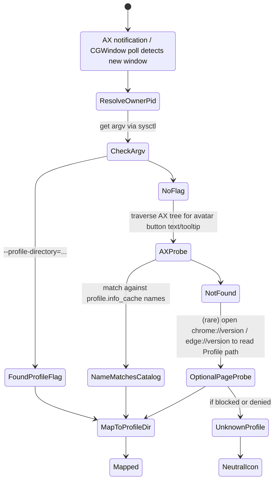

# TASKBAR\_SKELETON.md

> Flutter + macOS repo skeleton for a Windows‑style taskbar (multi‑monitor, pins, per‑window entries, Edge/Chrome profile awareness, jump lists).
> Drop this into a fresh Flutter project; use it as scaffolding for an LLM coding agent.

---

## 0) Project layout (proposed)

```
.
├─ pubspec.yaml
├─ lib/
│  ├─ main.dart
│  ├─ src/
│  │  ├─ app.dart
│  │  ├─ models.dart
│  │  ├─ services/
│  │  │  ├─ bar_controller.dart
│  │  │  ├─ state_store.dart
│  │  │  ├─ native_channel.dart
│  │  │  ├─ profile_catalog.dart
│  │  │  └─ window_mapper.dart
│  │  └─ ui/
│  │     ├─ taskbar.dart
│  │     ├─ bar_tile.dart
│  │     ├─ context_menus.dart
│  │     └─ theming.dart
└─ macos/Runner/
   ├─ AppDelegate.swift
   ├─ Info.plist
   ├─ DebugProfile.entitlements
   ├─ Release.entitlements
   ├─ Native/
   │  ├─ WindowList.swift
   │  ├─ AccessibilityGlue.swift
   │  ├─ WindowPlacement.swift
   │  ├─ JumpLists.swift
   │  ├─ ChromiumProfiles.swift
   │  ├─ ProcArgs.swift
   │  └─ Bridge.swift
   └─ Assets.xcassets/ (optional)
```

---

## 1) `pubspec.yaml`

```yaml
name: macos_taskbar
description: Windows-style taskbar for macOS (Flutter)
environment:
  sdk: ">=3.4.0 <4.0.0"

dependencies:
  flutter:
    sdk: flutter
  collection: ^1.18.0
  shared_preferences: ^2.2.3
  window_manager: ^0.3.9
  macos_window_utils: ^1.4.0
  screen_retriever: ^0.2.8
  desktop_multi_window: ^0.2.0
  super_context_menu: ^0.7.0

dev_dependencies:
  flutter_lints: ^4.0.0
```

---

## 2) macOS entitlements & Info.plist

### 2.1 `macos/Runner/DebugProfile.entitlements` (unsandboxed for dev)

```xml
<?xml version="1.0" encoding="UTF-8"?>
<!DOCTYPE plist PUBLIC "-//Apple//DTD PLIST 1.0//EN"
 "http://www.apple.com/DTDs/PropertyList-1.0.dtd">
<plist version="1.0"><dict>
  <key>com.apple.security.app-sandbox</key><false/>
  <!-- Needed to control other apps via AX -->
  <key>com.apple.security.automation.apple-events</key><true/>
</dict></plist>
```

> For App Store builds you’ll need a sandboxed variant and a different feature set. This skeleton targets non‑MAS first.

### 2.2 `macos/Runner/Info.plist` additions

```xml
<key>NSAppleEventsUsageDescription</key>
<string>This app uses Apple Events to open files and automate limited actions in other apps when you click jump list tasks.</string>
```

> Accessibility permission (for moving/reading other windows) is requested at runtime via `AXIsProcessTrustedWithOptions`; no Info.plist key exists—macOS shows its own prompt when first needed.

---

## 3) Dart: models

### 3.1 `lib/src/models.dart`

```dart
import 'dart:ui';

class DisplayId {
  final int id; // native NSScreen number or ordinal index
  DisplayId(this.id);
}

class WindowInfo {
  final int windowNumber; // CGWindowID
  final int ownerPid;
  final String ownerName; // e.g., "Microsoft Edge"
  final String title;
  final Rect bounds; // in screen points
  final int displayId;
  WindowInfo({
    required this.windowNumber,
    required this.ownerPid,
    required this.ownerName,
    required this.title,
    required this.bounds,
    required this.displayId,
  });
}

class AppPin {
  final String bundleId;          // e.g., com.microsoft.Edge
  final String? profileDir;       // "Default" | "Profile 1" | null
  final String displayName;       // Visible label
  final int? colorSeed;           // Chromium profile color seed (optional)
  final int? fillArgb;            // default_avatar_fill_color
  final int? strokeArgb;          // default_avatar_stroke_color
  final String? gaiaImagePath;    // optional local path
  final String? launchArgs;       // custom args for non-Chromium apps
  AppPin({
    required this.bundleId,
    this.profileDir,
    required this.displayName,
    this.colorSeed,
    this.fillArgb,
    this.strokeArgb,
    this.gaiaImagePath,
    this.launchArgs,
  });

  bool get isChromium => bundleId == 'com.microsoft.Edge' || bundleId == 'com.google.Chrome';
}

class RunningEntry {
  final WindowInfo window;
  final AppPin? occupyingPin; // if a pin "owns" this window (same app/profile)
  RunningEntry(this.window, this.occupyingPin);
}
```

---

## 4) Dart: native channel contracts

### 4.1 `lib/src/services/native_channel.dart`

```dart
import 'dart:ui';
import 'package:flutter/services.dart';
import '../models.dart';

class Native {
  static const MethodChannel _chan = MethodChannel('sys.bridge');

  // WINDOWS & DISPLAYS
  static Future<List<WindowInfo>> listWindowsForDisplay(int displayId) async {
    final list = (await _chan.invokeMethod<List>('listWindowsForDisplay', {'displayId': displayId})) ?? [];
    return list.map((m) => WindowInfo(
      windowNumber: m['windowNumber'],
      ownerPid: m['ownerPid'],
      ownerName: m['ownerName'],
      title: m['title'] ?? '',
      bounds: Rect.fromLTWH(
        (m['x'] as num).toDouble(),
        (m['y'] as num).toDouble(),
        (m['w'] as num).toDouble(),
        (m['h'] as num).toDouble(),
      ),
      displayId: m['displayId'],
    )).toList();
  }

  static Future<void> setSelfWindowToBarLevel(int displayId, double height) =>
    _chan.invokeMethod('setSelfWindowToBarLevel', {'displayId': displayId, 'height': height});

  static Future<void> focusWindow(int windowNumber) =>
    _chan.invokeMethod('focusWindow', {'windowNumber': windowNumber});

  static Future<void> moveWindowAvoidingBar(int windowNumber, int displayId, Map<String, num> avoidRect) =>
    _chan.invokeMethod('moveWindowAvoidingBar', {
      'windowNumber': windowNumber,
      'displayId': displayId,
      'avoid': avoidRect
    });

  // CHROMIUM PROFILES (Edge/Chrome)
  static Future<List<Map<String, dynamic>>> listChromiumProfiles(String bundleId) async {
    final list = await _chan.invokeMethod<List>('listChromiumProfiles', {'bundleId': bundleId}) ?? [];
    return List<Map<String, dynamic>>.from(list);
  }

  static Future<String?> detectChromiumProfileForWindow(String bundleId, int windowNumber) =>
    _chan.invokeMethod<String>('detectChromiumProfileForWindow', {
      'bundleId': bundleId, 'windowNumber': windowNumber
    });

  static Future<void> launchChromiumProfile({
    required String bundleId,
    required String profileDir,
    String? url,
    bool newWindow = false,
    int? displayId,
    Map<String, num>? avoidRect,
  }) => _chan.invokeMethod('launchChromiumProfile', {
      'bundleId': bundleId,
      'profileDir': profileDir,
      'url': url,
      'newWindow': newWindow,
      'displayId': displayId,
      'avoid': avoidRect,
    });

  // JUMP LISTS
  static Future<List<Map<String, dynamic>>> recentDocsForApp(String bundleId, {int limit = 10}) async =>
    List<Map<String, dynamic>>.from(
      (await _chan.invokeMethod<List>('recentDocsForApp', {'bundleId': bundleId, 'limit': limit})) ?? []
    );

  static Future<void> openFileWithApp(String bundleId, String filePath, {int? displayId, Map<String, num>? avoidRect}) =>
    _chan.invokeMethod('openFileWithApp', {
      'bundleId': bundleId, 'filePath': filePath, 'displayId': displayId, 'avoid': avoidRect
    });

  // PERMISSIONS
  static Future<bool> ensureAccessibilityPermission() async =>
    (await _chan.invokeMethod<bool>('ensureAccessibilityPermission')) ?? false;
}
```

---

## 5) Dart: profile catalog & window mapper

### 5.1 `lib/src/services/profile_catalog.dart`

```dart
import '../models.dart';
import 'native_channel.dart';

class ProfileCatalog {
  final Map<String, List<AppPin>> _byBundle = {};

  Future<void> refreshFor(String bundleId) async {
    final rows = await Native.listChromiumProfiles(bundleId);
    _byBundle[bundleId] = rows.map((r) => AppPin(
      bundleId: bundleId,
      profileDir: r['profileDir'],
      displayName: r['name'] ?? r['profileDir'],
      colorSeed: r['colorSeed'],
      fillArgb: r['fillArgb'],
      strokeArgb: r['strokeArgb'],
      gaiaImagePath: r['gaiaImagePath'],
    )).toList();
  }

  List<AppPin> profiles(String bundleId) => _byBundle[bundleId] ?? const [];
  AppPin? byBundleAndDir(String bundleId, String dir) =>
    profiles(bundleId).firstWhere((p) => p.profileDir == dir, orElse: () => AppPin(bundleId: bundleId, profileDir: dir, displayName: dir));
}
```

### 5.2 `lib/src/services/window_mapper.dart`

```dart
import '../models.dart';
import 'native_channel.dart';
import 'profile_catalog.dart';

class WindowMapper {
  final ProfileCatalog catalog;
  WindowMapper(this.catalog);

  /// Attempt to label a Chromium window with profile info.
  Future<AppPin?> mapChromiumWindow(WindowInfo w) async {
    final bundleId = _bundleIdForOwner(w.ownerName);
    if (bundleId == null) return null;

    // Probe: argv flag (--profile-directory)
    final dir = await Native.detectChromiumProfileForWindow(bundleId, w.windowNumber);
    if (dir != null) {
      final pin = catalog.byBundleAndDir(bundleId, dir);
      return pin;
    }
    return null; // Fallbacks (AX avatar probe) happen natively inside detectChromiumProfileForWindow.
  }

  String? _bundleIdForOwner(String ownerName) {
    // Lightweight mapping; improve as needed
    switch (ownerName) {
      case 'Google Chrome': return 'com.google.Chrome';
      case 'Microsoft Edge': return 'com.microsoft.Edge';
      default: return null;
    }
  }
}
```

---

## 6) Dart: controller + UI

### 6.1 `lib/src/services/bar_controller.dart`

```dart
import 'dart:async';
import 'package:collection/collection.dart';
import '../models.dart';
import 'native_channel.dart';
import 'profile_catalog.dart';
import 'window_mapper.dart';

class BarController {
  final int displayId;
  final double barHeight;
  final ProfileCatalog profiles;
  final WindowMapper mapper;

  BarController({required this.displayId, required this.barHeight, required this.profiles})
      : mapper = WindowMapper(profiles);

  final _pins = <AppPin>[];
  final _running = <RunningEntry>[];

  List<AppPin> get pins => List.unmodifiable(_pins);
  List<RunningEntry> get running => List.unmodifiable(_running);

  Future<void> init() async {
    await Native.setSelfWindowToBarLevel(displayId, barHeight);
    await profiles.refreshFor('com.google.Chrome');
    await profiles.refreshFor('com.microsoft.Edge');
    await refreshWindows();
  }

  Future<void> refreshWindows() async {
    final list = await Native.listWindowsForDisplay(displayId);
    _running
      ..clear()
      ..addAll(await Future.wait(list.map((w) async {
        AppPin? pin;
        pin ??= await mapper.mapChromiumWindow(w);
        return RunningEntry(w, pin);
      })));
    // sort: pins first via occupyingPin, then by title
    _running.sort((a, b) {
      final ap = a.occupyingPin != null ? 0 : 1;
      final bp = b.occupyingPin != null ? 0 : 1;
      final d = ap.compareTo(bp);
      return d != 0 ? d : a.window.title.compareTo(b.window.title);
    });
  }

  void addPin(AppPin pin) => _pins.add(pin);
  void reorderPins(int oldIndex, int newIndex) {
    final p = _pins.removeAt(oldIndex);
    _pins.insert(newIndex, p);
  }

  Future<void> openPin(AppPin pin) async {
    if (pin.isChromium && pin.profileDir != null) {
      await Native.launchChromiumProfile(
        bundleId: pin.bundleId,
        profileDir: pin.profileDir!,
        newWindow: false,
        displayId: displayId,
        avoidRect: {'x': 0, 'y': 0, 'w': 0, 'h': barHeight},
      );
      return;
    }
    // TODO: generic launch for non-Chromium
  }
}
```

### 6.2 `lib/src/ui/theming.dart`

```dart
import 'package:flutter/material.dart';

class AppTheme {
  static ThemeData theme() => ThemeData(
    brightness: Brightness.dark,
    useMaterial3: true,
    splashFactory: NoSplash.splashFactory,
    highlightColor: Colors.transparent,
    hoverColor: Colors.white.withOpacity(0.06),
  );
}
```

### 6.3 `lib/src/ui/bar_tile.dart`

```dart
import 'dart:ui';
import 'package:flutter/material.dart';
import '../models.dart';

class BarTile extends StatelessWidget {
  final AppPin? pin;            // null when showing a plain running window
  final WindowInfo? window;     // optional window when running
  final bool active;
  final VoidCallback onTap;
  final VoidCallback? onSecondary;

  const BarTile({super.key, this.pin, this.window, required this.active, required this.onTap, this.onSecondary});

  @override
  Widget build(BuildContext context) {
    final label = pin?.displayName ?? (window?.title.isEmpty == true ? (window?.ownerName ?? '') : window!.title);
    final profileColor = pin?.fillArgb != null ? Color(pin!.fillArgb!) : null;

    return GestureDetector(
      onTap: onTap,
      onSecondaryTap: onSecondary,
      child: Container(
        padding: const EdgeInsets.symmetric(horizontal: 6),
        constraints: const BoxConstraints(minWidth: 44, maxWidth: 180, minHeight: 40),
        decoration: BoxDecoration(
          color: active ? Colors.white.withOpacity(0.08) : Colors.transparent,
          borderRadius: BorderRadius.circular(8),
          border: Border.all(color: active ? Colors.white.withOpacity(0.25) : Colors.white.withOpacity(0.12)),
        ),
        child: Row(
          children: [
            _AvatarBadge(color: profileColor),
            const SizedBox(width: 8),
            Expanded(child: Text(label, maxLines: 1, overflow: TextOverflow.ellipsis)),
            if (active) Container(height: 2, width: 20),
          ],
        ),
      ),
    );
  }
}

class _AvatarBadge extends StatelessWidget {
  final Color? color;
  const _AvatarBadge({this.color});
  @override
  Widget build(BuildContext context) {
    return Container(
      width: 24, height: 24,
      decoration: BoxDecoration(
        shape: BoxShape.circle,
        color: color ?? Colors.white.withOpacity(0.15),
      ),
    );
  }
}
```

### 6.4 `lib/src/ui/taskbar.dart`

```dart
import 'package:flutter/material.dart';
import 'package:super_context_menu/super_context_menu.dart';
import '../models.dart';
import '../services/bar_controller.dart';

class Taskbar extends StatefulWidget {
  final BarController controller;
  final double height;
  const Taskbar({super.key, required this.controller, this.height = 44});
  @override
  State<Taskbar> createState() => _TaskbarState();
}

class _TaskbarState extends State<Taskbar> {
  @override
  void initState() {
    super.initState();
    widget.controller.init().then((_) => setState(() {}));
  }

  @override
  Widget build(BuildContext context) {
    final pins = widget.controller.pins;
    final running = widget.controller.running;

    return Container(
      height: widget.height,
      padding: const EdgeInsets.symmetric(horizontal: 8),
      child: Row(
        children: [
          // PINS (reorderable)
          Expanded(
            child: ReorderableListView.builder(
              scrollDirection: Axis.horizontal,
              buildDefaultDragHandles: false,
              proxyDecorator: (child, index, anim) => child,
              onReorder: (o, n) => setState(() => widget.controller.reorderPins(o, n > o ? n - 1 : n)),
              itemBuilder: (_, i) {
                final pin = pins[i];
                return ContextMenuWidget(
                  key: ValueKey('pin_$i'),
                  menuProvider: (_) => Menu(children: [
                    MenuAction(title: 'Open', callback: () => widget.controller.openPin(pin)),
                    MenuAction(title: 'Unpin', callback: () { /* TODO */ }),
                  ]),
                  child: Padding(
                    padding: const EdgeInsets.symmetric(horizontal: 4),
                    child: BarTile(pin: pin, active: false, onTap: () => widget.controller.openPin(pin)),
                  ),
                );
              },
              itemCount: pins.length,
            ),
          ),
          const VerticalDivider(width: 10),
          // RUNNING
          Expanded(
            child: ListView.separated(
              scrollDirection: Axis.horizontal,
              itemBuilder: (_, i) {
                final r = running[i];
                return ContextMenuWidget(
                  menuProvider: (_) => Menu(children: [
                    MenuAction(title: 'Focus', callback: () { /* TODO focus */ }),
                    if (r.occupyingPin == null) MenuAction(title: 'Pin', callback: () { /* TODO */ }),
                  ]),
                  child: Padding(
                    padding: const EdgeInsets.symmetric(horizontal: 4),
                    child: BarTile(pin: r.occupyingPin, window: r.window, active: false, onTap: () { /* TODO: focus */ }),
                  ),
                );
              },
              separatorBuilder: (_, __) => const SizedBox(width: 6),
              itemCount: running.length,
            ),
          ),
        ],
      ),
    );
  }
}
```

### 6.5 `lib/src/app.dart`

```dart
import 'package:flutter/material.dart';
import 'ui/taskbar.dart';
import 'services/bar_controller.dart';
import 'services/profile_catalog.dart';
import 'ui/theming.dart';

class TaskbarApp extends StatelessWidget {
  final int displayId;
  final double height;
  const TaskbarApp({super.key, required this.displayId, this.height = 44});

  @override
  Widget build(BuildContext context) {
    final controller = BarController(
      displayId: displayId,
      barHeight: height,
      profiles: ProfileCatalog(),
    );
    return MaterialApp(
      debugShowCheckedModeBanner: false,
      theme: AppTheme.theme(),
      home: Scaffold(
        backgroundColor: const Color(0x00101010),
        body: Align(
          alignment: Alignment.bottomCenter,
          child: Taskbar(controller: controller, height: height),
        ),
      ),
    );
  }
}
```

### 6.6 `lib/main.dart`

```dart
import 'dart:ui';
import 'package:flutter/material.dart';
import 'package:desktop_multi_window/desktop_multi_window.dart';
import 'package:screen_retriever/screen_retriever.dart';
import 'src/app.dart';

Future<void> main(List<String> args) async {
  WidgetsFlutterBinding.ensureInitialized();

  // Root instance: spawn a bar window per display.
  final displays = await ScreenRetriever.instance.getAllDisplays();
  if (DesktopMultiWindow.isMultiWindowSupported) {
    for (final d in displays) {
      final window = await DesktopMultiWindow.createWindow('{"displayId": ${d.id}}');
      await window.setTitle('Taskbar ${d.id}');
      await window.setFrame(const Offset(0, 0), Size(d.size.width, 44));
      await window.center();
      window.show();
      window.setResizable(false);
    }
  } else {
    runApp(TaskbarApp(displayId: displays.first.id));
  }
}

// Sub-window entry
@pragma('vm:entry-point')
void multiWindowMain(dynamic args) {
  final map = args is String ? (args.isEmpty ? {} : (args as String)) : args;
  final displayId = int.tryParse(map.toString().replaceAll(RegExp(r'[^0-9]'), '')) ?? 0;
  runApp(TaskbarApp(displayId: displayId));
}
```

---

## 7) macOS native glue (Swift)

### 7.1 `macos/Runner/Native/Bridge.swift`

```swift
import Cocoa
import FlutterMacOS

public class BridgePlugin: NSObject, FlutterPlugin {
  public static func register(with registrar: FlutterPluginRegistrar) {
    let channel = FlutterMethodChannel(name: "sys.bridge", binaryMessenger: registrar.messenger)
    let instance = BridgePlugin()
    registrar.addMethodCallDelegate(instance, channel: channel)
  }

  public func handle(_ call: FlutterMethodCall, result: @escaping FlutterResult) {
    switch call.method {
    case "listWindowsForDisplay":
      guard let args = call.arguments as? [String: Any],
            let displayId = args["displayId"] as? Int else { return result([]) }
      result(WindowList.list(displayId: displayId))
    case "setSelfWindowToBarLevel":
      guard let args = call.arguments as? [String: Any],
            let height = args["height"] as? Double else { return result(false) }
      WindowPlacement.setSelfWindowToBarLevel(height: CGFloat(height))
      result(true)
    case "focusWindow":
      guard let args = call.arguments as? [String: Any],
            let win = args["windowNumber"] as? Int else { return result(false) }
      AccessibilityGlue.focus(windowNumber: CGWindowID(win))
      result(true)
    case "moveWindowAvoidingBar":
      guard let args = call.arguments as? [String: Any],
            let win = args["windowNumber"] as? Int,
            let displayId = args["displayId"] as? Int,
            let avoid = args["avoid"] as? [String: Any] else { return result(false) }
      let r = NSRect(x: (avoid["x"] as? Double) ?? 0.0, y: (avoid["y"] as? Double) ?? 0.0,
                     width: (avoid["w"] as? Double) ?? 0.0, height: (avoid["h"] as? Double) ?? 0.0)
      AccessibilityGlue.nudgeAwayFromBar(windowNumber: CGWindowID(win), displayId: displayId, avoid: r)
      result(true)
    case "listChromiumProfiles":
      guard let args = call.arguments as? [String: Any],
            let bundleId = args["bundleId"] as? String else { return result([]) }
      result(ChromiumProfiles.list(bundleId: bundleId))
    case "detectChromiumProfileForWindow":
      guard let args = call.arguments as? [String: Any],
            let bundleId = args["bundleId"] as? String,
            let win = args["windowNumber"] as? Int else { return result(nil) }
      result(ChromiumProfiles.detectProfileForWindow(bundleId: bundleId, windowNumber: CGWindowID(win)))
    case "launchChromiumProfile":
      guard let args = call.arguments as? [String: Any],
            let bundleId = args["bundleId"] as? String,
            let profileDir = args["profileDir"] as? String else { return result(false) }
      let url = args["url"] as? String
      let newWindow = (args["newWindow"] as? Bool) ?? false
      let displayId = args["displayId"] as? Int
      let avoid = (args["avoid"] as? [String: Any]).flatMap { NSRect(x: ($0["x"] as? Double) ?? 0, y: ($0["y"] as? Double) ?? 0, width: ($0["w"] as? Double) ?? 0, height: ($0["h"] as? Double) ?? 0) } ?? .zero
      ChromiumProfiles.launch(bundleId: bundleId, profileDir: profileDir, url: url, newWindow: newWindow, moveToDisplay: displayId, avoid: avoid)
      result(true)
    case "recentDocsForApp":
      guard let args = call.arguments as? [String: Any],
            let bundleId = args["bundleId"] as? String else { return result([]) }
      let limit = (args["limit"] as? Int) ?? 10
      result(JumpLists.recentDocs(bundleId: bundleId, limit: limit))
    case "openFileWithApp":
      guard let args = call.arguments as? [String: Any],
            let bundleId = args["bundleId"] as? String,
            let filePath = args["filePath"] as? String else { return result(false) }
      let displayId = args["displayId"] as? Int
      let avoid = (args["avoid"] as? [String: Any]).flatMap { NSRect(x: ($0["x"] as? Double) ?? 0, y: ($0["y"] as? Double) ?? 0, width: ($0["w"] as? Double) ?? 0, height: ($0["h"] as? Double) ?? 0) } ?? .zero
      JumpLists.openFile(bundleId: bundleId, path: filePath, moveToDisplay: displayId, avoid: avoid)
      result(true)
    case "ensureAccessibilityPermission":
      result(AccessibilityGlue.ensurePermission())
    default:
      result(FlutterMethodNotImplemented)
    }
  }
}
```

### 7.2 Register plugin in `macos/Runner/AppDelegate.swift`

```swift
import Cocoa
import FlutterMacOS

@main
class AppDelegate: FlutterAppDelegate {
  override func applicationShouldTerminateAfterLastWindowClosed(_ sender: NSApplication) -> Bool { true }

  override func applicationDidFinishLaunching(_ notification: Notification) {
    super.applicationDidFinishLaunching(notification)
  }

  override func applicationShouldHandleReopen(_ sender: NSApplication, hasVisibleWindows flag: Bool) -> Bool {
    return true
  }

  override func registerPlugins(with registry: FlutterPluginRegistry) {
    BridgePlugin.register(with: registry.registrar(forPlugin: "BridgePlugin"))
    super.registerPlugins(with: registry)
  }
}
```

### 7.3 `macos/Runner/Native/WindowList.swift`

```swift
import Cocoa

struct WindowList {
  static func list(displayId: Int) -> [[String: Any]] {
    guard let screen = NSScreen.screens.first(where: { $0.displayID == displayId }) ?? NSScreen.main else { return [] }
    let frame = screen.frame
    let options: CGWindowListOption = [.optionOnScreenOnly, .excludeDesktopElements]
    let infoList = CGWindowListCopyWindowInfo(options, kCGNullWindowID) as? [[String: Any]] ?? []

    return infoList.compactMap { info in
      let layer = info[kCGWindowLayer as String] as? Int ?? 0
      if layer != 0 { return nil }
      let ownerPid = info[kCGWindowOwnerPID as String] as? Int ?? -1
      let ownerName = info[kCGWindowOwnerName as String] as? String ?? ""
      let windowNumber = info[kCGWindowNumber as String] as? Int ?? 0
      guard let boundsDict = info[kCGWindowBounds as String] as? [String: CGFloat] else { return nil }
      let b = NSRect(x: boundsDict["X"]!, y: boundsDict["Y"]!, width: boundsDict["Width"]!, height: boundsDict["Height"]!)
      if !frame.intersects(b) { return nil }
      let title = (info[kCGWindowName as String] as? String) ?? ""
      return [
        "windowNumber": windowNumber,
        "ownerPid": ownerPid,
        "ownerName": ownerName,
        "title": title,
        "x": b.origin.x, "y": b.origin.y, "w": b.size.width, "h": b.size.height,
        "displayId": screen.displayID
      ]
    }
  }
}

extension NSScreen {
  var displayID: Int {
    return Int((self.deviceDescription[NSDeviceDescriptionKey("NSScreenNumber")] as? NSNumber)?.intValue ?? 0)
  }
}
```

### 7.4 `macos/Runner/Native/WindowPlacement.swift`

```swift
import Cocoa

struct WindowPlacement {
  static func setSelfWindowToBarLevel(height: CGFloat) {
    guard let win = NSApplication.shared.windows.first(where: { $0.isKeyWindow || $0.isVisible }) else { return }
    win.level = .statusBar
    win.collectionBehavior = [.moveToActiveSpace, .canJoinAllSpaces]
    win.isOpaque = false
    win.backgroundColor = NSColor.clear
    // Position at bottom of its screen
    if let screen = win.screen {
      let f = screen.frame
      let bar = NSRect(x: f.minX, y: f.minY, width: f.width, height: height)
      win.setFrame(bar, display: true)
    }
  }
}
```

### 7.5 `macos/Runner/Native/AccessibilityGlue.swift`

```swift
import Cocoa
import ApplicationServices

struct AccessibilityGlue {
  static func ensurePermission() -> Bool {
    let opts: NSDictionary = [kAXTrustedCheckOptionPrompt.takeUnretainedValue() as String: true]
    return AXIsProcessTrustedWithOptions(opts)
  }

  static func focus(windowNumber: CGWindowID) {
    guard let pid = pidForWindow(windowNumber) else { return }
    let app = AXUIElementCreateApplication(pid)
    if let win = topWindowElement(app) {
      AXUIElementPerformAction(win, kAXRaiseAction as CFString)
    }
  }

  static func nudgeAwayFromBar(windowNumber: CGWindowID, displayId: Int, avoid: NSRect) {
    guard let pid = pidForWindow(windowNumber) else { return }
    let app = AXUIElementCreateApplication(pid)
    guard let win = topWindowElement(app) else { return }
    var pos = CGPoint.zero
    var size = CGSize.zero
    AXUIElementCopyAttributeValue(win, kAXPositionAttribute as CFString, &pos as CFTypeRef?)
    AXUIElementCopyAttributeValue(win, kAXSizeAttribute as CFString, &size as CFTypeRef?)

    var frame = NSRect(origin: pos, size: size)
    // If intersects avoid rect, push up
    if frame.intersects(avoid) {
      frame.origin.y = avoid.origin.y + avoid.size.height + 2
      AXUIElementSetAttributeValue(win, kAXPositionAttribute as CFString, NSValue(point: frame.origin) as CFTypeRef)
    }
  }

  private static func topWindowElement(_ app: AXUIElement) -> AXUIElement? {
    var value: AnyObject?
    if AXUIElementCopyAttributeValue(app, kAXWindowsAttribute as CFString, &value) == .success,
       let arr = value as? [AXUIElement], let first = arr.first {
      return first
    }
    return nil
  }

  static func pidForWindow(_ windowNumber: CGWindowID) -> pid_t? {
    guard let list = CGWindowListCopyWindowInfo([.optionOnScreenOnly], windowNumber) as? [[String: Any]] else { return nil }
    return (list.first?[kCGWindowOwnerPID as String] as? pid_t)
  }
}
```

### 7.6 `macos/Runner/Native/ProcArgs.swift`

```swift
import Foundation

struct ProcArgs {
  /// Try to read process argv for a pid (for --profile-directory=...).
  static func argv(pid: pid_t) -> [String] {
    // KERN_PROCARGS2 via sysctl is a common approach.
    // Skeleton: return empty on failure; LLM agent can fill the implementation.
    return []
  }

  static func chromiumProfileFromArgs(_ argv: [String]) -> String? {
    if let idx = argv.firstIndex(where: { $0.hasPrefix("--profile-directory=") }) {
      return String(argv[idx].split(separator: "=").last ?? "")
    }
    return nil
  }
}
```

### 7.7 `macos/Runner/Native/ChromiumProfiles.swift`

```swift
import Cocoa

struct ChromiumProfiles {
  static func userDataDir(bundleId: String) -> URL? {
    let home = FileManager.default.homeDirectoryForCurrentUser
    switch bundleId {
    case "com.google.Chrome": return home.appendingPathComponent("Library/Application Support/Google/Chrome")
    case "com.microsoft.Edge": return home.appendingPathComponent("Library/Application Support/Microsoft Edge")
    default: return nil
    }
  }

  static func list(bundleId: String) -> [[String: Any]] {
    guard let root = userDataDir(bundleId: bundleId) else { return [] }
    let localState = root.appendingPathComponent("Local State")
    guard let data = try? Data(contentsOf: localState),
          let json = try? JSONSerialization.jsonObject(with: data) as? [String: Any],
          let cache = (json["profile"] as? [String: Any])?["info_cache"] as? [String: Any] else { return [] }

    var out: [[String: Any]] = []
    for (dir, entryAny) in cache {
      guard let entry = entryAny as? [String: Any] else { continue }
      out.append([
        "profileDir": dir,
        "name": entry["name"] as? String ?? dir,
        "avatarIcon": entry["avatar_icon"] as? String ?? "",
        "colorSeed": entry["profile_color_seed"] as? Int ?? 0,
        "fillArgb": entry["default_avatar_fill_color"] as? Int ?? 0,
        "strokeArgb": entry["default_avatar_stroke_color"] as? Int ?? 0,
        "gaiaImagePath": (entry["gaia_picture_file_name"] as? String).map { root.appendingPathComponent(dir).appendingPathComponent($0).path } ?? ""
      ])
    }
    return out.sorted { ($0["name"] as? String ?? "") < ($1["name"] as? String ?? "") }
  }

  static func detectProfileForWindow(bundleId: String, windowNumber: CGWindowID) -> String? {
    // 1) From argv flag if present
    guard let pid = AccessibilityGlue.pidForWindow(windowNumber) else { return nil }
    let args = ProcArgs.argv(pid: pid)
    if let direct = ProcArgs.chromiumProfileFromArgs(args) { return direct }

    // 2) Optional AX avatar button probe (LLM agent can implement):
    // traverse accessibility tree to find a control whose help/title == profile name,
    // then match to info_cache names. Return its directory.
    return nil
  }

  static func launch(bundleId: String, profileDir: String, url: String?, newWindow: Bool, moveToDisplay: Int?, avoid: NSRect) {
    guard let appURL = NSWorkspace.shared.urlForApplication(withBundleIdentifier: bundleId),
          let bin = appURL.appendingPathComponent("Contents/MacOS/\(appURL.deletingPathExtension().lastPathComponent)").path.removingPercentEncoding else { return }
    var args = ["--profile-directory=\(profileDir)"]
    if newWindow { args.append("--new-window") }
    if let url = url { args.append(url) }

    let task = Process()
    task.launchPath = bin
    task.arguments = args
    task.launch()

    // Optionally: poll for the new window and move it above bar on target display
    if let displayId = moveToDisplay {
      DispatchQueue.main.asyncAfter(deadline: .now() + 0.6) {
        // LLM agent: enumerate Edge/Chrome windows, pick newest for PID, nudge via AccessibilityGlue.nudgeAwayFromBar
      }
    }
  }
}
```

### 7.8 `macos/Runner/Native/JumpLists.swift`

```swift
import Cocoa
import UniformTypeIdentifiers
import QuickLookThumbnailing

struct JumpLists {
  static func recentDocs(bundleId: String, limit: Int) -> [[String: Any]] {
    let home = FileManager.default.homeDirectoryForCurrentUser
    let sfl = home
      .appendingPathComponent("Library/Application Support/com.apple.sharedfilelist/com.apple.LSSharedFileList.ApplicationRecentDocuments/\(bundleId).sfl2")
    guard let data = try? Data(contentsOf: sfl),
          let plist = try? PropertyListSerialization.propertyList(from: data, options: [], format: nil) else { return [] }

    // Extract bookmark Data blobs from the property list.
    var urls: [URL] = []
    func walk(_ any: Any) {
      if let dict = any as? [String: Any] { dict.values.forEach(walk) }
      else if let arr = any as? [Any] { arr.forEach(walk) }
      else if let d = any as? Data {
        var stale = false
        if let url = try? URL(resolvingBookmarkData: d, options: .withoutUI, relativeTo: nil, bookmarkDataIsStale: &stale),
           url.isFileURL { urls.append(url) }
      }
    }
    walk(plist)

    let uniq = Array(Set(urls)).prefix(limit)
    return uniq.map { url in
      ["path": url.path, "name": (try? url.resourceValues(forKeys: [.localizedNameKey]).localizedName) ?? url.lastPathComponent]
    }
  }

  static func openFile(bundleId: String, path: String, moveToDisplay: Int?, avoid: NSRect) {
    let url = URL(fileURLWithPath: path)
    NSWorkspace.shared.open([url], withAppBundleIdentifier: bundleId, options: [], additionalEventParamDescriptor: nil, launchIdentifiers: nil)
    // Optional: move newly-opened window into safe area after small delay (via AccessibilityGlue)
  }
}
```

---

## 8) Mermaid state diagram (window→profile mapping)



---

## 9) Minimal usage notes

* Run once; you’ll get bar windows per display with placeholder tiles.
* Add pins programmatically (e.g., Chrome Work/Personal) and click to launch; the Swift side will spawn the browser with `--profile-directory=<dir>`.
* Grant **Accessibility** permission when prompted for focus/move behaviors.
* Jump Lists: right‑click a pin to fetch recent docs; opening a recent routes it through the target bundle ID and then (optionally) moves the window above the bar.

---

## 10) Next tasks for the LLM agent (TODOs)

1. **Complete `ProcArgs.argv`** on macOS using `sysctl` KERN\_PROCARGS2 to read argv for another process (same user).
2. **Implement AX avatar probe** in `ChromiumProfiles.detectProfileForWindow`:

   * Build `AXUIElementCreateApplication(pid)`, iterate windows, locate a toolbar button with help/title containing the profile name, map to `info_cache` key.
3. **Focus behavior**: clicking a running window should call `AccessibilityGlue.focus(windowNumber:)`.
4. **Per‑window “avoid bar”**: fill `nudgeAwayFromBar` to adjust `AXPosition/AXSize` to keep windows from overlapping the bar rect.
5. **Per‑display spawning**: in `multiWindowMain`, pick the correct `NSScreen` by `displayId` and pin the Flutter window to the bottom of that screen (already stubbed in `WindowPlacement.setSelfWindowToBarLevel`).
6. **Persistence**: implement `state_store.dart` with `shared_preferences`/`hive` to store pins and order per display.
7. **Context menus**: wire `super_context_menu` actions for Pin/Unpin, Recent/Tasks (Tasks can use AppleScript/URL schemes later).
8. **Styling**: refine Windows‑like visuals (hover/active underlines, grouping modes), add GAIA avatar image compositing for Chromium profiles.
9. **Performance**: diff window lists and only repaint changed tiles; debounce refresh on AX notifications.
10. **Edge/Chrome channels**: extend `ChromiumProfiles.userDataDir` to also scan Beta/Dev/Canary (and Edge Beta/Dev) and tag `channel`.

---

## 11) Commands

```bash
# Create project (if needed)
flutter create --platforms=macos macos_taskbar
cd macos_taskbar

# Replace files with the skeleton above (lib/, macos/Runner/*, pubspec.yaml)

# Get packages
flutter pub get

# Run (macOS)
flutter run -d macos
```

---

## 12) Notes / constraints

* macOS does not allow third‑party apps to reserve work‑area like the Dock; “keep windows off the bar” is emulated via Accessibility (nudging).
* Launching an app “on a specific display” is achieved by launching, then moving its first window to that display.
* App Store sandboxing will restrict reading other apps’ recents and profile catalogs; this skeleton assumes non‑MAS distribution for full features.

---

*End of skeleton.*
