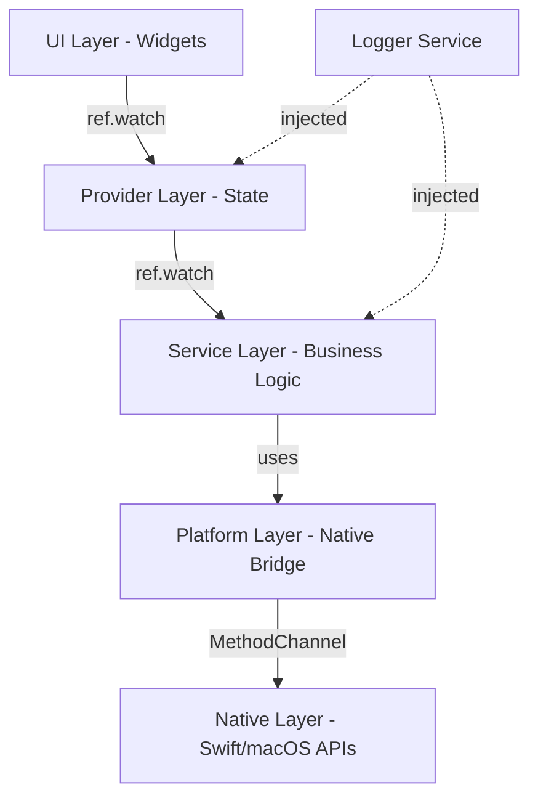

# Riverpod Architecture Guide for Goodbar

> The definitive guide for state management, dependency injection, and reactive programming in the Goodbar macOS taskbar application using Riverpod 2.x with code generation.

## Table of Contents

1. [ADRs](#adrs)
2. [Core Principles](#core-principles)
3. [Architecture Layers](#architecture-layers)
4. [Provider Patterns](#provider-patterns)
5. [Service Layer Integration](#service-layer-integration)
6. [Error Handling](#error-handling)
7. [State Management Patterns](#state-management-patterns)
8. [Testing Strategy](#testing-strategy)
9. [Golden Testing](#golden-testing)
10. [Performance Optimization](#performance-optimization)
11. [Desktop Patterns](#desktop-patterns)
12. [CI/CD & DX](#cicd--dx)
13. [Benchmarks & Measurement](#benchmarks--measurement)
14. [Migration Guide](#migration-guide)
15. [Troubleshooting](#troubleshooting)
16. [Code Review Checklist](#code-review-checklist)
17. [References & Resources](#references--resources)

---

## ADRs

Short, load‑bearing decisions with rationale and source anchors. When evolving, amend the ADR rather than deleting it.

- ADR‑001: Riverpod 2.x codegen Notifier/AsyncNotifier (`@riverpod`). Strong typing, lifecycle hooks, minimal boilerplate, official lints. Source: Riverpod docs.
- ADR‑002: DI via providers (constructor injection). Services are exposed as providers, injected with `ref.watch`, easily overridden in tests. Source: Riverpod overrides.
- ADR‑003: Choose `AsyncNotifier` for long‑lived async state; use `FutureProvider`/`StreamProvider` for simple fetch/subscribe. Source: (Async)Notifier docs.
- ADR‑004: Prefer Pigeon for type‑safe platform APIs; EventChannel for continuous streams. MethodChannel acceptable for bootstrap; plan migration. Source: Flutter platform channels + Pigeon.
- ADR‑005: Functional error handling with `Result<T, Failure>` end‑to‑end; transform to `AsyncValue` at provider edge. Source: FP libs on pub.dev.
- ADR‑006: Desktop windowing & prefs via `window_manager` and `shared_preferences` (NSUserDefaults). Multi‑window via `desktop_multi_window` when needed.
- ADR‑007: Display changes bridged via CoreGraphics callbacks (`CGDisplayRegisterReconfigurationCallback`) to a Dart Stream.
- ADR‑008: Performance via granular providers, `select`/`selectAsync`, and ProviderObservers + DevTools profiling.
- ADR‑009: Snapshot testing with `golden_toolkit` or `alchemist`; standardize one approach and load fonts in tests.

## Core Principles

### 1. Use Code Generation (`@riverpod`)
Always prefer code generation over manual providers. This provides:
- Type safety and compile-time checks
- Better IDE support and refactoring
- Automatic disposal management
- Consistent patterns across the codebase

```dart
// GOOD: Code generation
@riverpod
class Displays extends _$Displays {
  @override
  FutureOr<List<Display>> build() async {
    // Implementation
  }
}

// BAD: Manual provider
final displaysProvider = AsyncNotifierProvider<DisplaysNotifier, List<Display>>(() {
  return DisplaysNotifier();
});
```

### 2. Strict Layer Separation
Data flows unidirectionally through well-defined layers:
```
UI Widgets  Providers/Pods  Services  Platform Channels  Native
```
Never skip layers or create circular dependencies.

### 3. Functional Error Handling
Use `result_dart` for Result<T,E> pattern throughout:
- Services return `Result<T, Failure>`
- Providers transform to `AsyncValue`
- UI handles via `when()` pattern

### 4. Desktop-First Patterns
As a long-running desktop application:
- Use `keepAlive: true` for services
- Manage window lifecycle explicitly
- Handle system events (display changes, sleep/wake)
- Optimize for memory over startup time

---

## Architecture Layers

### Layer Responsibilities



### 1. UI Layer (Widgets)
- **Responsibility**: Presentation and user interaction
- **Rules**:
  - Always use `ConsumerWidget` or `ConsumerStatefulWidget`
  - Never instantiate services directly
  - Handle `AsyncValue` with `when()` or `whenData()`
  - No business logic, only UI logic

### 2. Provider Layer (State Management)
- **Responsibility**: Application state and orchestration
- **Rules**:
  - Use `@riverpod` code generation
  - Expose `AsyncValue<T>` for async operations
  - Transform service `Result<T,E>` to `AsyncValue`
  - Manage subscriptions and lifecycle

### 3. Service Layer (Business Logic)
- **Responsibility**: Core business operations
- **Rules**:
  - Define abstract interfaces
  - Return `Result<T, Failure>` for fallible operations
  - Inject dependencies via constructor
  - No UI or Provider awareness

### 4. Platform Layer (Native Bridge)
- **Responsibility**: Flutter-to-native communication
- **Rules**:
  - Use type-safe channels (prefer Pigeon, accept MethodChannel)
  - Map native types to domain models
  - Handle platform exceptions

### 5. Native Layer (Swift/Objective-C)
- **Responsibility**: OS-level APIs and system integration
- **Rules**:
  - CoreGraphics for display management
  - NSWorkspace for app launching
  - Accessibility APIs for window management

---

## Provider Patterns

### When to Use Each Provider Type

#### 1. `@Riverpod` AsyncNotifier
Use for complex stateful operations that need lifecycle management:

```dart
@riverpod
class Displays extends _$Displays {
  StreamSubscription? _subscription;
  
  @override
  FutureOr<List<Display>> build() async {
    // Initial load
    final service = ref.watch(screenServiceProvider);
    final result = await service.getDisplays();
    
    // Subscribe to changes
    _subscription?.cancel();
    _subscription = service.displayChanges().listen((_) => _refresh());
    
    // Cleanup
    ref.onDispose(() => _subscription?.cancel());
    
    return result.getOrElse((failure) => throw failure);
  }
  
  Future<void> refresh() async {
    state = const AsyncLoading();
    final service = ref.read(screenServiceProvider);
    final result = await service.getDisplays();
    state = result.fold(
      (displays) => AsyncData(displays),
      (failure) => AsyncError(failure, failure.stackTrace ?? StackTrace.current),
    );
  }
}
```

**Use AsyncNotifier when:**
- Managing subscriptions or timers
- Needing mutation methods
- Complex initialization logic
- Optimistic updates required

#### 2. `@riverpod` FutureProvider
Use for simple async reads without mutations:

```dart
@riverpod
Future<AppConfig> appConfig(AppConfigRef ref) async {
  final service = ref.watch(configServiceProvider);
  final result = await service.loadConfig();
  return result.getOrElse((failure) => throw failure);
}
```

**Use FutureProvider when:**
- One-shot data fetching
- No mutation needed
- Simple computed async values

#### 3. `@riverpod` StreamProvider
Use for continuous data streams:

```dart
@riverpod
Stream<WindowEvent> windowEvents(WindowEventsRef ref) {
  final service = ref.watch(windowServiceProvider);
  return service.windowEventStream();
}
```

**Use StreamProvider when:**
- Wrapping existing streams
- Real-time updates without state management
- Events that don't need buffering

#### 4. `@Riverpod` Notifier (Synchronous)
Use for synchronous state management:

```dart
@riverpod
class SelectedDisplay extends _$SelectedDisplay {
  @override
  String? build() => null;
  
  void select(String displayId) {
    state = displayId;
  }
  
  void clear() {
    state = null;
  }
}
```

**Use Notifier when:**
- Managing UI state (selections, toggles)
- Synchronous mutations
- Simple state machines

#### 5. Provider Families
Use for parameterized providers:

```dart
@riverpod
class TaskbarState extends _$TaskbarState {
  @override
  FutureOr<TaskbarData> build(String displayId) async {
    // Per-display taskbar state
    final prefs = await ref.watch(preferencesServiceProvider)
        .getTaskbarPreferences(displayId);
    return TaskbarData.fromPreferences(prefs);
  }
  
  void pinApp(String bundleId) {
    // Optimistic update
    state = AsyncData(state.requireValue.copyWith(
      pins: [...state.requireValue.pins, bundleId],
    ));
    // Persist async...
  }
}
```

**Family parameters must be:**
- Immutable
- Have proper equality (primitives or @freezed)
- Stable across rebuilds

---

## Service Layer Integration

### Dependency Injection Pattern

Services are provided via `@Riverpod` providers with `keepAlive: true`:

```dart
// lib/src/bootstrap/services.dart

@Riverpod(keepAlive: true)
ScreenService screenService(ScreenServiceRef ref) {
  final logger = ref.watch(loggerProvider('ScreenService'));
  return MacOSScreenService(logger: logger);
}

@Riverpod(keepAlive: true)
WindowService windowService(WindowServiceRef ref) {
  final logger = ref.watch(loggerProvider('WindowService'));
  return WindowServiceImpl(logger: logger);
}

@Riverpod(keepAlive: true)
PreferencesService preferencesService(PreferencesServiceRef ref) {
  final logger = ref.watch(loggerProvider('PreferencesService'));
  return SharedPreferencesService(logger: logger);
}
```

### Service Interface Pattern

All services follow this pattern:

```dart
// lib/src/services/screen/screen_service.dart

import 'package:result_dart/result_dart.dart';

abstract interface class ScreenService {
  /// Get all connected displays
  Future<Result<List<Display>, ScreenFailure>> getDisplays();
  
  /// Get specific display by ID
  Future<Result<Display, ScreenFailure>> getDisplay(String displayId);
  
  /// Stream of display configuration changes
  Stream<DisplayChangeEvent> displayChanges();
  
  /// Cleanup resources
  void dispose();
}
```

### Service Implementation

```dart
// lib/src/services/screen/macos_screen_service.dart

class MacOSScreenService implements ScreenService {
  final AppLogger _logger;
  final _channel = const MethodChannel('com.goodbar/screens');
  final _eventChannel = const EventChannel('com.goodbar/screen_events');
  
  MacOSScreenService({required AppLogger logger}) : _logger = logger;
  
  @override
  Future<Result<List<Display>, ScreenFailure>> getDisplays() async {
    try {
      final List<dynamic>? result = await _channel.invokeMethod('getDisplays');
      if (result == null) {
        return Failure(PlatformChannelFailure('No displays returned'));
      }
      
      final displays = result.map((data) => _parseDisplay(data)).toList();
      _logger.d('Retrieved ${displays.length} displays');
      return Success(displays);
      
    } on PlatformException catch (e, st) {
      _logger.e('Platform exception getting displays', e, st);
      return Failure(PlatformChannelFailure(e.message ?? 'Unknown platform error'));
    } catch (e, st) {
      _logger.e('Unexpected error getting displays', e, st);
      return Failure(UnknownScreenFailure(e.toString()));
    }
  }
  
  @override
  Stream<DisplayChangeEvent> displayChanges() {
    return _eventChannel.receiveBroadcastStream()
        .map((data) => _parseDisplayChangeEvent(data))
        .handleError((e, st) {
          _logger.e('Error in display change stream', e, st);
        });
  }
}
```

#### Pigeon migration note (type‑safe channels)

- Define request/response classes and APIs in a `pigeon/` Dart file.
- Generate code:
  - `flutter pub run pigeon --input pigeon/api.dart --dart_out lib/src/pigeon/api.g.dart --swift_out macos/Runner/PigeonApi.g.swift`
- Replace `MethodChannel`/`EventChannel` calls with the generated Dart API; implement host handlers in Swift.
- Map generated DTOs to domain models (`Display`) in a thin adapter.

---

## Error Handling

### Failure Types

Define sealed failure hierarchies per domain:

```dart
// lib/src/core/failures/screen_failures.dart

sealed class ScreenFailure implements Exception {
  final String message;
  final Object? cause;
  final StackTrace? stackTrace;
  
  const ScreenFailure(this.message, {this.cause, this.stackTrace});
}

final class PlatformChannelFailure extends ScreenFailure {
  const PlatformChannelFailure(super.message, {super.cause, super.stackTrace});
}

final class DisplayNotFoundFailure extends ScreenFailure {
  final String displayId;
  const DisplayNotFoundFailure(this.displayId)
      : super('Display $displayId not found');
}

final class UnknownScreenFailure extends ScreenFailure {
  const UnknownScreenFailure(super.message, {super.cause, super.stackTrace});
}
```

### Result Transformation in Providers

```dart
@riverpod
class Displays extends _$Displays {
  @override
  FutureOr<List<Display>> build() async {
    final service = ref.watch(screenServiceProvider);
    final result = await service.getDisplays();
    
    // Transform Result to AsyncValue via throw
    return result.getOrElse((failure) {
      _logger.e('Failed to get displays: ${failure.message}', failure.cause, failure.stackTrace);
      throw failure;
    });
  }
  
  Future<void> refresh() async {
    state = const AsyncLoading();
    final service = ref.read(screenServiceProvider);
    final result = await service.getDisplays();
    
    // Transform Result to AsyncValue directly
    state = result.fold(
      (displays) => AsyncData(displays),
      (failure) => AsyncError(failure, failure.stackTrace ?? StackTrace.current),
    );
  }
}
```

### UI Error Handling

```dart
class DisplaysScreen extends ConsumerWidget {
  @override
  Widget build(BuildContext context, WidgetRef ref) {
    final displaysAsync = ref.watch(displaysProvider);
    
    return displaysAsync.when(
      loading: () => const Center(child: CircularProgressIndicator()),
      error: (error, stack) => ErrorView(
        error: error,
        onRetry: () => ref.invalidate(displaysProvider),
      ),
      data: (displays) => DisplayList(displays: displays),
    );
  }
}

class ErrorView extends StatelessWidget {
  final Object error;
  final VoidCallback onRetry;
  
  @override
  Widget build(BuildContext context) {
    final message = switch (error) {
      PlatformChannelFailure(:final message) => 'Platform error: $message',
      DisplayNotFoundFailure(:final displayId) => 'Display $displayId not found',
      ScreenFailure(:final message) => message,
      _ => 'An unexpected error occurred',
    };
    
    return Center(
      child: Column(
        mainAxisSize: MainAxisSize.min,
        children: [
          Icon(Icons.error_outline, size: 48, color: Theme.of(context).colorScheme.error),
          const SizedBox(height: 16),
          Text(message, style: Theme.of(context).textTheme.headlineSmall),
          const SizedBox(height: 16),
          ElevatedButton.icon(
            onPressed: onRetry,
            icon: const Icon(Icons.refresh),
            label: const Text('Retry'),
          ),
        ],
      ),
    );
  }
}
```

---

## State Management Patterns

### 1. Optimistic Updates

For responsive UI in desktop apps:

```dart
@riverpod
class TaskbarPins extends _$TaskbarPins {
  @override
  FutureOr<List<AppPin>> build(String displayId) async {
    final service = ref.watch(pinServiceProvider);
    final result = await service.getPins(displayId);
    return result.getOrThrow();
  }
  
  Future<void> addPin(String bundleId) async {
    // Optimistic update
    final currentPins = state.requireValue;
    final newPin = AppPin(bundleId: bundleId, displayId: arg);
    state = AsyncData([...currentPins, newPin]);
    
    // Persist
    final service = ref.read(pinServiceProvider);
    final result = await service.addPin(arg, bundleId);
    
    result.fold(
      (success) => {}, // Already updated optimistically
      (failure) {
        // Rollback on failure
        state = AsyncData(currentPins);
        // Show error snackbar
        ref.read(snackbarServiceProvider).showError(failure.message);
      },
    );
  }
}
```

### 2. Debouncing User Input

For search and filtering:

```dart
@riverpod
class WindowSearch extends _$WindowSearch {
  Timer? _debounceTimer;
  
  @override
  Future<List<WindowInfo>> build() async => [];
  
  void search(String query) {
    _debounceTimer?.cancel();
    
    if (query.isEmpty) {
      state = const AsyncData([]);
      return;
    }
    
    state = const AsyncLoading();
    _debounceTimer = Timer(const Duration(milliseconds: 300), () async {
      final service = ref.read(windowServiceProvider);
      final result = await service.searchWindows(query);
      state = result.fold(
        (windows) => AsyncData(windows),
        (failure) => AsyncError(failure, failure.stackTrace ?? StackTrace.current),
      );
    });
  }
  
  @override
  void dispose() {
    _debounceTimer?.cancel();
    super.dispose();
  }
}
```

### 3. Polling with Exponential Backoff

For status monitoring:

```dart
@riverpod
class AppStatus extends _$AppStatus {
  Timer? _pollTimer;
  Duration _backoff = const Duration(seconds: 1);
  
  @override
  FutureOr<AppHealth> build() async {
    _startPolling();
    return _checkHealth();
  }
  
  void _startPolling() {
    _pollTimer?.cancel();
    _pollTimer = Timer(_backoff, () async {
      try {
        final health = await _checkHealth();
        state = AsyncData(health);
        _backoff = const Duration(seconds: 1); // Reset on success
      } catch (e, st) {
        state = AsyncError(e, st);
        _backoff = Duration(seconds: (_backoff.inSeconds * 2).clamp(1, 60));
      }
      _startPolling(); // Schedule next check
    });
  }
  
  @override
  void dispose() {
    _pollTimer?.cancel();
    super.dispose();
  }
}
```

### 4. Cross-Provider Synchronization

Using `ref.listen` for reactive updates:

```dart
@riverpod
class ActiveDisplay extends _$ActiveDisplay {
  @override
  String? build() {
    // React to display changes
    ref.listen(displaysProvider, (previous, next) {
      next.whenData((displays) {
        // If current selection removed, clear it
        if (state != null && !displays.any((d) => d.id == state)) {
          state = null;
        }
      });
    });
    
    return null;
  }
  
  void select(String displayId) {
    state = displayId;
  }
}
```

---

## Testing Strategy

### Unit Testing Providers

```dart
// test/features/displays/providers/displays_provider_test.dart

import 'package:flutter_test/flutter_test.dart';
import 'package:flutter_riverpod/flutter_riverpod.dart';
import 'package:result_dart/result_dart.dart';

void main() {
  group('DisplaysProvider', () {
    late ProviderContainer container;
    late FakeScreenService fakeService;
    
    setUp(() {
      fakeService = FakeScreenService();
      container = ProviderContainer(
        overrides: [
          screenServiceProvider.overrideWithValue(fakeService),
        ],
      );
    });
    
    tearDown(() {
      container.dispose();
    });
    
    test('initial load fetches displays', () async {
      // Arrange
      fakeService.setDisplays([
        Display(id: '1', width: 1920, height: 1080),
        Display(id: '2', width: 2560, height: 1440),
      ]);
      
      // Act
      final subscription = container.listen(displaysProvider, (_, __) {});
      await container.pump(); // Wait for async resolution
      
      // Assert
      expect(container.read(displaysProvider).requireValue.length, 2);
      subscription.close();
    });
    
    test('handles service failure', () async {
      // Arrange
      fakeService.setFailure(PlatformChannelFailure('Connection failed'));
      
      // Act
      final subscription = container.listen(displaysProvider, (_, __) {});
      await container.pump();
      
      // Assert
      expect(
        container.read(displaysProvider).hasError,
        isTrue,
      );
      expect(
        container.read(displaysProvider).error,
        isA<PlatformChannelFailure>(),
      );
      subscription.close();
    });
    
    test('refreshes on display change event', () async {
      // Arrange
      fakeService.setDisplays([Display(id: '1', width: 1920, height: 1080)]);
      final subscription = container.listen(displaysProvider, (_, __) {});
      await container.pump();
      
      // Act - simulate display change
      fakeService.emitDisplayChange([
        Display(id: '1', width: 1920, height: 1080),
        Display(id: '2', width: 2560, height: 1440),
      ]);
      await container.pump();
      
      // Assert
      expect(container.read(displaysProvider).requireValue.length, 2);
      subscription.close();
    });
  });
}
```

### Widget Testing

```dart
// test/features/displays/widgets/displays_screen_test.dart

import 'package:flutter/material.dart';
import 'package:flutter_test/flutter_test.dart';
import 'package:flutter_riverpod/flutter_riverpod.dart';

void main() {
  group('DisplaysScreen', () {
    testWidgets('shows loading indicator initially', (tester) async {
      await tester.pumpWidget(
        ProviderScope(
          overrides: [
            displaysProvider.overrideWith(() => LoadingDisplaysNotifier()),
          ],
          child: const MaterialApp(home: DisplaysScreen()),
        ),
      );
      
      expect(find.byType(CircularProgressIndicator), findsOneWidget);
    });
    
    testWidgets('shows error view with retry on failure', (tester) async {
      await tester.pumpWidget(
        ProviderScope(
          overrides: [
            displaysProvider.overrideWith(() => FailingDisplaysNotifier()),
          ],
          child: const MaterialApp(home: DisplaysScreen()),
        ),
      );
      
      await tester.pump(); // Start loading
      await tester.pump(); // Show error
      
      expect(find.text('Platform error: Test failure'), findsOneWidget);
      expect(find.widgetWithText(ElevatedButton, 'Retry'), findsOneWidget);
    });
    
    testWidgets('shows display list when loaded', (tester) async {
      final displays = [
        Display(id: '1', width: 1920, height: 1080, scale: 2.0),
        Display(id: '2', width: 2560, height: 1440, scale: 2.0),
      ];
      
      await tester.pumpWidget(
        ProviderScope(
          overrides: [
            displaysProvider.overrideWith(() => MockDisplaysNotifier(displays)),
          ],
          child: const MaterialApp(home: DisplaysScreen()),
        ),
      );
      
      await tester.pump();
      
      expect(find.text('Display 1'), findsOneWidget);
      expect(find.text('Display 2'), findsOneWidget);
      expect(find.text('19201080 @2.0x'), findsOneWidget);
    });
  });
}
```

### Integration Testing

```dart
// integration_test/displays_integration_test.dart

import 'package:flutter_test/flutter_test.dart';
import 'package:integration_test/integration_test.dart';
import 'package:goodbar/main.dart' as app;

void main() {
  IntegrationTestWidgetsFlutterBinding.ensureInitialized();
  
  group('Display Detection Integration', () {
    testWidgets('detects actual system displays', (tester) async {
      // Start the app
      app.main();
      await tester.pumpAndSettle();
      
      // Navigate to displays screen
      await tester.tap(find.text('Displays'));
      await tester.pumpAndSettle();
      
      // Verify at least one display detected
      expect(find.textContaining('Display'), findsAtLeastNWidgets(1));
      
      // On test machine with 3 displays, verify all detected
      if (const bool.fromEnvironment('CI') == false) {
        expect(find.textContaining('Display'), findsNWidgets(3));
      }
    });
    
    testWidgets('responds to display configuration changes', (tester) async {
      app.main();
      await tester.pumpAndSettle();
      
      // Navigate to displays screen
      await tester.tap(find.text('Displays'));
      await tester.pumpAndSettle();
      
      // Count initial displays
      final initialCount = find.textContaining('Display').evaluate().length;
      
      // NOTE: In real test, trigger display change via system API or manual intervention
      // For CI, this might involve a mock display change event
      
      await Future.delayed(const Duration(seconds: 5));
      await tester.pumpAndSettle();
      
      // Verify display count updated if changed
      // This is environment-specific
    });
  });
}
```

---

## Golden Testing

Standardize on one library for goldens and wire it into CI.

- Choice: `golden_toolkit` (widely used utilities like `loadAppFonts`) or `alchemist` (cross‑platform stability). Pick one and stick to it.
- Add `test/flutter_test_config.dart` with `await loadAppFonts();` for consistent typography.
- Keep themes/locales/time deterministic; avoid platform text diffs.

Example (`golden_toolkit`):

```dart
// test/flutter_test_config.dart
import 'package:golden_toolkit/golden_toolkit.dart';
Future<void> testExecutable(FutureOr<void> Function() testMain) async {
  await loadAppFonts();
  return testMain();
}
```

```dart
// test/features/displays/displays_view_golden_test.dart
import 'package:golden_toolkit/golden_toolkit.dart';
void main() {
  testGoldens('DisplaysView renders', (tester) async {
    await tester.pumpWidgetBuilder(const DisplaysView());
    await screenMatchesGolden(tester, 'displays_view_default');
  });
}
```

## Performance Optimization

### 1. Use `select()` for Granular Rebuilds

```dart
// BAD: Rebuilds on any display property change
final display = ref.watch(displaysProvider
    .select((displays) => displays.firstWhere((d) => d.id == displayId)));

// GOOD: Rebuilds only when specific display's name changes
final displayName = ref.watch(displaysProvider
    .select((displays) => displays.firstWhere((d) => d.id == displayId).name));
```

### 2. Split Large State Objects

```dart
// BAD: Single large state object
@riverpod
class AppState extends _$AppState {
  @override
  AppStateData build() => AppStateData(
    displays: [],
    windows: [],
    pins: [],
    preferences: {},
    // ... many more fields
  );
}

// GOOD: Separate providers for each concern
@riverpod
class Displays extends _$Displays {
  @override
  FutureOr<List<Display>> build() async => /* ... */;
}

@riverpod
class Windows extends _$Windows {
  @override
  FutureOr<List<WindowInfo>> build(String displayId) async => /* ... */;
}

@riverpod
class Pins extends _$Pins {
  @override
  FutureOr<List<AppPin>> build(String displayId) async => /* ... */;
}
```

### 3. Avoid Expensive Computations in `build()`

```dart
// BAD: Heavy computation in build
@riverpod
List<ProcessedWindow> processedWindows(ProcessedWindowsRef ref) {
  final windows = ref.watch(windowsProvider);
  return windows.map((w) => expensiveProcessing(w)).toList(); // Runs on every rebuild
}

// GOOD: Cache expensive computations
@riverpod
class ProcessedWindows extends _$ProcessedWindows {
  @override
  List<ProcessedWindow> build() {
    final windows = ref.watch(windowsProvider);
    
    // Cache based on window IDs
    return ref.cache(
      windows.map((w) => w.id).join(','),
      () => windows.map((w) => expensiveProcessing(w)).toList(),
    );
  }
}
```

### 4. Profile with ProviderObserver

```dart
// lib/src/bootstrap/observers.dart

class RiverpodProfiler extends ProviderObserver {
  final _updateCounts = <String, int>{};
  final _updateTimes = <String, List<Duration>>{};
  
  @override
  void didUpdateProvider(
    ProviderBase provider,
    Object? previousValue,
    Object? newValue,
    ProviderContainer container,
  ) {
    final name = provider.name ?? provider.runtimeType.toString();
    _updateCounts[name] = (_updateCounts[name] ?? 0) + 1;
    
    // Log suspicious frequent updates
    if (_updateCounts[name]! > 100) {
      logger.w('Provider $name updated ${_updateCounts[name]} times');
    }
  }
  
  @override
  void providerDidFail(
    ProviderBase provider,
    Object error,
    StackTrace stackTrace,
    ProviderContainer container,
  ) {
    logger.e('Provider ${provider.name} failed', error, stackTrace);
  }
}
```

---

## Code Templates

### Complete Feature Template

```dart
// lib/src/features/example/providers/example_provider.dart

import 'package:riverpod_annotation/riverpod_annotation.dart';
import 'package:result_dart/result_dart.dart';

part 'example_provider.g.dart';

/// Manages example feature state.
/// 
/// This provider:
/// - Loads initial data from ExampleService
/// - Subscribes to real-time updates
/// - Provides mutation methods for user actions
@riverpod
class ExampleState extends _$ExampleState {
  StreamSubscription? _subscription;
  
  @override
  FutureOr<List<ExampleItem>> build() async {
    // Get service
    final service = ref.watch(exampleServiceProvider);
    
    // Load initial data
    final result = await service.getItems();
    
    // Subscribe to updates
    _subscription?.cancel();
    _subscription = service.itemUpdates().listen(_onItemUpdate);
    
    // Cleanup
    ref.onDispose(() {
      _subscription?.cancel();
    });
    
    // Handle result
    return result.fold(
      (items) => items,
      (failure) {
        _logger.e('Failed to load items', failure);
        throw failure;
      },
    );
  }
  
  Future<void> addItem(String name) async {
    // Optimistic update
    final current = state.requireValue;
    final newItem = ExampleItem(id: uuid(), name: name);
    state = AsyncData([...current, newItem]);
    
    // Persist
    final service = ref.read(exampleServiceProvider);
    final result = await service.addItem(newItem);
    
    result.fold(
      (_) {}, // Success - already updated
      (failure) {
        // Rollback
        state = AsyncData(current);
        ref.read(snackbarProvider).showError(failure.message);
      },
    );
  }
  
  Future<void> removeItem(String id) async {
    final current = state.requireValue;
    state = AsyncData(current.where((item) => item.id != id).toList());
    
    final service = ref.read(exampleServiceProvider);
    final result = await service.removeItem(id);
    
    result.fold(
      (_) {},
      (failure) {
        state = AsyncData(current);
        ref.read(snackbarProvider).showError(failure.message);
      },
    );
  }
  
  void _onItemUpdate(ItemUpdateEvent event) {
    state.whenData((items) {
      switch (event.type) {
        case ItemUpdateType.added:
          state = AsyncData([...items, event.item]);
        case ItemUpdateType.removed:
          state = AsyncData(items.where((i) => i.id != event.item.id).toList());
        case ItemUpdateType.updated:
          state = AsyncData(items.map((i) => i.id == event.item.id ? event.item : i).toList());
      }
    });
  }
}
```

---

## Migration Guide

### From Direct Service Instantiation

```dart
// OLD: Direct instantiation in widgets
class _TestDisplayDetectionState extends State<TestDisplayDetection> {
  late final MacOSScreenService _screenService;
  
  @override
  void initState() {
    super.initState();
    final logger = AppLogger(appName: 'goodbar');
    _screenService = MacOSScreenService(logger: logger);
    _loadDisplays();
  }
  
  Future<void> _loadDisplays() async {
    final result = await _screenService.getDisplays();
    setState(() {
      // Update state
    });
  }
}

// NEW: Provider-based approach
class DisplaysScreen extends ConsumerWidget {
  @override
  Widget build(BuildContext context, WidgetRef ref) {
    final displaysAsync = ref.watch(displaysProvider);
    
    return displaysAsync.when(
      loading: () => const LoadingView(),
      error: (e, st) => ErrorView(error: e, onRetry: () => ref.invalidate(displaysProvider)),
      data: (displays) => DisplayListView(displays: displays),
    );
  }
}
```

### From setState to AsyncNotifier

```dart
// OLD: setState pattern
void _loadDisplays() async {
  setState(() => _isLoading = true);
  try {
    final result = await _screenService.getDisplays();
    result.when(
      success: (displays) => setState(() {
        _displays = displays;
        _isLoading = false;
      }),
      failure: (error) => setState(() {
        _error = error;
        _isLoading = false;
      }),
    );
  } catch (e) {
    setState(() {
      _error = e.toString();
      _isLoading = false;
    });
  }
}

// NEW: AsyncNotifier pattern
@riverpod
class Displays extends _$Displays {
  @override
  FutureOr<List<Display>> build() async {
    final service = ref.watch(screenServiceProvider);
    final result = await service.getDisplays();
    return result.getOrElse((failure) => throw failure);
  }
  
  Future<void> refresh() async {
    state = const AsyncLoading();
    final service = ref.read(screenServiceProvider);
    final result = await service.getDisplays();
    state = result.fold(
      (displays) => AsyncData(displays),
      (failure) => AsyncError(failure, failure.stackTrace ?? StackTrace.current),
    );
  }
}
```

---

## Desktop Patterns

- Preferences: `shared_preferences` (NSUserDefaults on macOS) for simple key/values like window geometry and per‑display prefs.
- Windowing: `window_manager` to get/set size/position and listen to window events; wrap in a `WindowService` behind a provider.
- Multiple windows: `desktop_multi_window` for secondary windows; share state via a common `ProviderContainer` or `ProviderScope` with overrides per window.
- System events: Bridge CoreGraphics display change callbacks and NSWorkspace notifications (sleep/wake) to Dart via EventChannels.
- Provider lifetime: Mark service providers `@Riverpod(keepAlive: true)` in long‑lived desktop apps.

```dart
@Riverpod(keepAlive: true)
WindowService windowService(WindowServiceRef ref) => WindowServiceImpl();
```

## CI/CD & DX

- Codegen: `dart run build_runner build --delete-conflicting-outputs` (use `watch` locally).
- Lints: Add `custom_lint` and `riverpod_lint`; run `dart run custom_lint` in CI.
- macOS CI: `flutter config --enable-macos-desktop` before tests; cache pub and build artifacts.
- just tasks (suggested): `just generate`, `just lint`, `just test`, `just goldens`, `just ci` (chains generate+lint+test).

Example CI steps:

```
flutter pub get
flutter config --enable-macos-desktop
dart run build_runner build --delete-conflicting-outputs
dart run custom_lint
flutter test
```

## Benchmarks & Measurement

- What: Widget rebuild counts, initial paint, update latency on display events, memory over time.
- How: Compare (A) `AsyncNotifier` controller, (B) `StreamProvider` wrapper, (C) imperative baseline. Script ~1,000 events/60s; capture with DevTools and ProviderObserver logs; apply `select` to reduce blast radius.

## Troubleshooting

### Common Issues and Solutions

#### 1. Provider Not Updating
**Symptom**: UI doesn't reflect state changes
**Common Causes**:
- Using `ref.read()` instead of `ref.watch()` in build method
- Mutating state directly instead of reassigning
- Missing `ref.invalidate()` after external changes

**Solution**:
```dart
// BAD
final displays = ref.read(displaysProvider); // Won't rebuild

// GOOD
final displays = ref.watch(displaysProvider); // Will rebuild
```

#### 2. Circular Dependency
**Symptom**: Stack overflow or initialization errors
**Common Causes**:
- Providers depending on each other circularly
- Using `ref.watch()` in service providers

**Solution**:
```dart
// BAD: Circular dependency
@riverpod
Service1 service1(Service1Ref ref) => Service1(ref.watch(service2Provider));

@riverpod
Service2 service2(Service2Ref ref) => Service2(ref.watch(service1Provider));

// GOOD: One-way dependency
@riverpod
Service1 service1(Service1Ref ref) => Service1();

@riverpod
Service2 service2(Service2Ref ref) => Service2(ref.watch(service1Provider));
```

#### 3. Memory Leaks
**Symptom**: Increasing memory usage over time
**Common Causes**:
- Uncanceled stream subscriptions
- Providers with `keepAlive: true` holding large data
- Timer not canceled in dispose

**Solution**:
```dart
@riverpod
class Example extends _$Example {
  StreamSubscription? _sub;
  Timer? _timer;
  
  @override
  FutureOr<Data> build() async {
    // Setup subscriptions
    _sub = stream.listen(handler);
    _timer = Timer.periodic(duration, callback);
    
    // CRITICAL: Clean up
    ref.onDispose(() {
      _sub?.cancel();
      _timer?.cancel();
    });
    
    return data;
  }
}
```

#### 4. Test Failures with Providers
**Symptom**: Tests fail with provider not found errors
**Common Causes**:
- Missing ProviderScope in test
- Incorrect overrides
- Async timing issues

**Solution**:
```dart
// GOOD: Proper test setup
testWidgets('test name', (tester) async {
  await tester.pumpWidget(
    ProviderScope(
      overrides: [
        serviceProvider.overrideWithValue(mockService),
      ],
      child: MaterialApp(home: WidgetUnderTest()),
    ),
  );
  
  // Allow async operations to complete
  await tester.pumpAndSettle();
  
  // Assertions...
});
```

---

## Code Review Checklist

Before merging any Riverpod-related code, verify:

### Architecture
- [ ] No direct service instantiation in widgets
- [ ] All services injected via providers
- [ ] Layer separation maintained (UI  Providers  Services  Platform)
- [ ] No platform types leak to UI layer

### Provider Patterns
- [ ] Uses `@riverpod` code generation (not manual)
- [ ] Appropriate provider type chosen (AsyncNotifier vs FutureProvider)
- [ ] Family providers use immutable, equality-stable keys
- [ ] `keepAlive: true` for long-lived services

### Error Handling
- [ ] Services return `Result<T, Failure>`
- [ ] Failures properly typed with context
- [ ] Providers transform Result to AsyncValue correctly
- [ ] UI handles all AsyncValue states (loading/error/data)

### Performance
- [ ] Uses `select()` for granular watches
- [ ] Large state split into focused providers
- [ ] No expensive computations in build()
- [ ] Stream subscriptions canceled in dispose

### Testing
- [ ] Unit tests use ProviderContainer with overrides
- [ ] Widget tests include ProviderScope
- [ ] All AsyncValue states tested
- [ ] Integration tests verify real platform behavior

### Code Quality
- [ ] Providers have clear documentation
- [ ] Consistent naming conventions
- [ ] No commented-out code
- [ ] Follows project style guide

---

## References & Resources

- Riverpod docs: getting started, codegen, overrides, select, observers, testing – https://riverpod.dev/
- Flutter platform channels & Pigeon – https://docs.flutter.dev/platform-integration/platform-channels
- CoreGraphics display reconfiguration (Apple) – https://developer.apple.com/library/archive/documentation/GraphicsImaging/Conceptual/QuartzDisplayServicesConceptual/Articles/Notification.html
- Desktop utilities: `window_manager` – https://pub.dev/packages/window_manager
- Persistence: `shared_preferences` – https://pub.dev/packages/shared_preferences
- Multi-window: `desktop_multi_window` – https://pub.dev/packages/desktop_multi_window
- Golden testing: `golden_toolkit` – https://pub.dev/documentation/golden_toolkit/latest/ ; `alchemist` – https://pub.dev/documentation/alchemist/latest/
- FP result libraries status: `result_dart`, `fpdart`, `oxidized`, `multiple_result`, `dartz` – see pub.dev packages

## Summary

This architecture provides:

1. **Type Safety**: Code generation ensures compile-time safety
2. **Testability**: Easy mocking via provider overrides
3. **Performance**: Granular rebuilds with select()
4. **Maintainability**: Clear layer separation and patterns
5. **Desktop Focus**: Long-lived services and system integration

Follow these patterns consistently across the Goodbar codebase to maintain a clean, performant, and maintainable architecture.

---

*Last Updated: September 2024*
*Based on: Riverpod 2.5.x, Flutter 3.x, result_dart 1.1.x*
