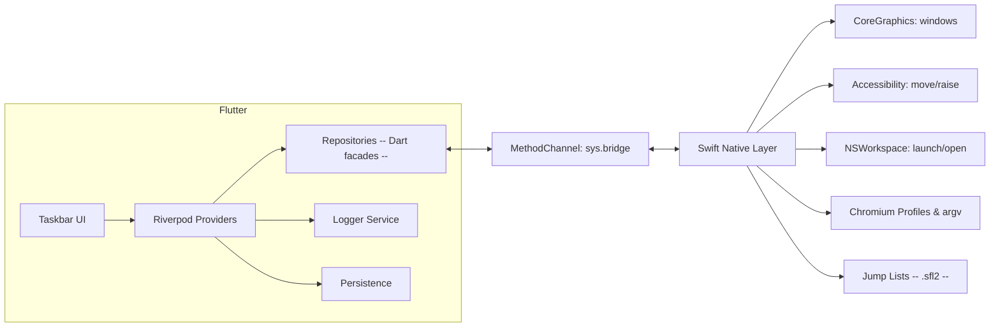

# ARCHITECTURE\_RULES.md

> Ground rules, idioms, and architecture for the macOS Taskbar (Flutter) project.
> Includes logging, Riverpod + Freezed usage, testing, and a `justfile` for smooth workflows.

---

## 1) Goals & Non‑Goals

**Goals**

* Windows‑style taskbar on macOS with per‑display instances, pins, per‑window entries.
* Edge/Chrome profile awareness (distinct colors/icons) even when launched outside the bar.
* Jump Lists (Recent/Tasks) and “launch on this display” placement.
* Strong testability and clear separation between UI, state, and native glue.

**Non‑Goals**

* Full Dock replacement or OS‑level work‑area reservation (not possible for third‑party apps).
* App Store sandbox parity for all features (unsandboxed build has the full feature set).

---

## 2) Architecture at a Glance

* **UI Layer (Flutter)** — taskbar surfaces, tiles, menus.
* **State Layer (Riverpod)** — providers for pins, running windows, profiles, jump lists, permissions.
* **Domain Models (Freezed)** — immutable, serializable models for windows, pins, profiles, results.
* **Interop Layer (Repositories)** — Dart facades that call **native Swift** via MethodChannels.
* **Native Layer (Swift)** — Window enumeration (CG), Accessibility (AX), NSWorkspace, Chromium profile parsing, Jump Lists.



**Layering rules**

* UI never touches MethodChannels directly; only through repositories.
* Providers expose **pure** state (prefer `AsyncValue<T>` for anything IO‑bound).
* All models are **Freezed** classes; no mutable DTOs.
* Side effects (launch, move windows, read profiles) live in repositories and are injected.

---

## 3) Coding Rules & Idioms

**General**

* Prefer **composition** over inheritance.
* Keep widget build methods small; extract widgets at \~50–80 lines.
* All public Dart APIs documented with `///`.
* Use **feature folders** inside `lib/src`:

  ```
  src/
    features/
      taskbar/
      pins/
      running/
      profiles/
      jumplists/
    platform/
      repositories/ (Dart facades)
      channels/ (MethodChannel wiring)
    core/
      logger/
      persistence/
      errors/
      utils/
  ```

**Naming**

* Providers: `xyzProvider`, async providers yield `AsyncValue<T>`.
* Repositories: `XyzRepository`.
* Models: nouns, singular (`WindowInfo`, `AppPin`, `BrowserProfile`).
* Freezed unions: suffix variants with meaningful states (`.success()`, `.failure()`).

**Async & Errors**

* Model fallible operations as `Result<T, Failure>` in service layer.
* Expose `AsyncValue<T>` from providers (not `AsyncValue<Result<T, Failure>>`).
* Transform `Result.failure` to `AsyncError` in providers via throw.

```dart
// ✅ GOOD - Service returns Result, provider exposes AsyncValue<T>
@riverpod
class Displays extends _$Displays {
  @override
  FutureOr<List<Display>> build() async {
    final service = ref.watch(screenServiceProvider);
    final result = await service.getDisplays(); // Result<List<Display>, Failure>
    
    return result.fold(
      (displays) => displays,           // Success → return data
      (failure) => throw failure,        // Failure → throw (becomes AsyncError)
    );
  }
}

// ❌ BAD - Don't expose AsyncValue<Result<T, E>>
@riverpod
Future<Result<List<Display>, Failure>> badDisplays(ref) async {
  // This pattern breaks AsyncValue.when() ergonomics
}
```

**Immutability**

* Use Freezed everywhere for models and results; no mutable fields.
* Keep Riverpod state in immutable snapshots (copyWith).

**Platform boundaries**

* Only repositories call MethodChannel. UI/state layers know nothing about Swift.

**Serialization**

* Use `json_serializable` where models need persistence; keep generated files checked in.

---

## 4) State Management (Riverpod) & Models (Freezed)

### 4.1 Packages

Add (in addition to skeleton):

```yaml
dependencies:
  riverpod: ^2.5.1
  flutter_riverpod: ^2.5.1
  riverpod_annotation: ^2.3.4
  freezed_annotation: ^2.4.4
  json_annotation: ^4.9.0

dev_dependencies:
  build_runner: ^2.4.11
  riverpod_generator: ^2.4.0
  freezed: ^2.5.7
  json_serializable: ^6.8.0
  mocktail: ^1.0.3
  flutter_test:
    sdk: flutter
  integration_test:
    sdk: flutter
  golden_toolkit: ^0.15.0
  riverpod_test: ^0.1.5
```

### 4.2 Freezed models (examples)

`lib/src/core/models/result.dart`

```dart
import 'package:freezed_annotation/freezed_annotation.dart';
part 'result.freezed.dart';

@freezed
sealed class Result<T, E> with _$Result<T, E> {
  const factory Result.success(T value) = _Success<T, E>;
  const factory Result.failure(E error) = _Failure<T, E>;
}
```

`lib/src/features/pins/models/app_pin.dart`

```dart
import 'package:freezed_annotation/freezed_annotation.dart';
part 'app_pin.freezed.dart';
part 'app_pin.g.dart';

@freezed
class AppPin with _$AppPin {
  const factory AppPin({
    required String bundleId,
    String? profileDir,
    required String displayName,
    int? colorSeed,
    int? fillArgb,
    int? strokeArgb,
    String? gaiaImagePath,
    String? launchArgs,
  }) = _AppPin;

  factory AppPin.fromJson(Map<String, dynamic> json) => _$AppPinFromJson(json);
}
```

### 4.3 Riverpod providers (patterns)

* **View‑model providers**: `@riverpod` classes exposing derived state for the UI.
* **Repository providers**: simple `Provider` wrapping a repository.
* **Family providers** for per‑display (`displayId`) instances.

Example:

```dart
// lib/src/features/running/providers/running_windows_provider.dart
import 'package:riverpod_annotation/riverpod_annotation.dart';
import '../../../platform/repositories/windows_repository.dart';
import '../../../core/models/result.dart';
import '../models/running_entry.dart';
part 'running_windows_provider.g.dart';

@riverpod
class RunningWindows extends _$RunningWindows {
  @override
  Future<Result<List<RunningEntry>, String>> build(int displayId) async {
    final repo = ref.watch(windowsRepositoryProvider);
    try {
      final list = await repo.listWindowsForDisplay(displayId);
      return Result.success(list);
    } catch (e) {
      return Result.failure(e.toString());
    }
  }
}
```

---

## 5) Logging

### 5.1 Choice

Use **`package:logger`** for app‑level logging. It’s widely used in Flutter, has the expected levels (`v/d/i/w/e/wtf`), pretty output in debug, and flexible outputs. We’ll wrap it in a small **LoggerService** to:

* unify level names (`debug/info/warn/error`),
* route to console in debug and **file** in release,
* enrich logs with **displayId**, **provider tag**, and **pid**.

### 5.2 Logger service

`lib/src/core/logger/logger.dart`

```dart
import 'dart:io';
import 'package:logger/logger.dart';
import 'package:flutter/foundation.dart' show kReleaseMode;

class Log {
  final Logger _logger;
  final String tag;

  Log._(this._logger, this.tag);

  factory Log.scoped(String tag, {Level level = Level.debug}) {
    final logFile = _resolveLogFile();
    final outputs = <LogOutput>[
      ConsoleOutput(),
      if (logFile != null) FileOutput(file: logFile),
    ];
    final printer = PrettyPrinter(
      methodCount: 0,
      errorMethodCount: 8,
      lineLength: 140,
      colors: !kReleaseMode,
      noBoxingByDefault: true,
      printTime: true,
    );
    return Log._(
      Logger(
        level: level,
        filter: ProductionFilter(), // still uses level
        printer: printer,
        output: MultiOutput(outputs),
      ),
      tag,
    );
  }

  static File? _resolveLogFile() {
    final home = Platform.environment['HOME'];
    if (home == null) return null;
    final dir = Directory('$home/Library/Logs/macos_taskbar');
    dir.createSync(recursive: true);
    return File('${dir.path}/app.log');
  }

  void v(String msg, [Object? e, StackTrace? st]) => _logger.v('[$tag] $msg', e, st);
  void d(String msg, [Object? e, StackTrace? st]) => _logger.d('[$tag] $msg', e, st);
  void i(String msg, [Object? e, StackTrace? st]) => _logger.i('[$tag] $msg', e, st);
  void w(String msg, [Object? e, StackTrace? st]) => _logger.w('[$tag] $msg', e, st);
  void e(String msg, [Object? e, StackTrace? st]) => _logger.e('[$tag] $msg', e, st);
  void wtf(String msg, [Object? e, StackTrace? st]) => _logger.wtf('[$tag] $msg', e, st);
}
```

**Usage**

```dart
final log = Log.scoped('RunningWindows');
log.i('refresh start for display=$displayId');
log.w('AX permission missing');
log.e('failed to parse Local State', err, st);
```

> If you prefer the standard library approach (`package:logging`), keep the `Log` API and swap the backend later; nothing else changes.

---

## 6) Testing Strategy

**Test pyramid**

* **Unit tests** (fast): models (Freezed), mappers, small repositories with fakes.
* **Widget/golden tests**: tiles, taskbar layout states, dark/light variants.
* **Integration tests** (selective, macOS): channel round‑trips with a **fake Swift** layer or a guarded real integration on a CI macOS runner.
* **HowTo tests** (documentation): compelling use cases demonstrating maximum value extraction.

### 6.1 Test Quality Assertions

**Avoid "happy path testing" anti‑pattern.** Always test for correctness and completeness, not just existence. Verify that data contains expected values, relationships, and patterns rather than merely checking if data exists.

```dart
// ❌ BAD - Only tests existence
test('extracts browser profiles', () async {
  final profiles = await repository.listProfiles('com.microsoft.Edge');
  expect(profiles.isNotEmpty, true); // Too weak!
});

// ✅ GOOD - Tests correctness
test('extracts browser profiles with complete metadata', () async {
  final profiles = await repository.listProfiles('com.microsoft.Edge');
  
  // Verify specific expected profiles
  final workProfile = profiles.firstWhere((p) => p.name == 'Work');
  expect(workProfile.profileDir, 'Profile 1');
  expect(workProfile.colorSeed, isNotNull);
  expect(workProfile.fillArgb, inInclusiveRange(-16777216, -1));
  
  // Verify relationships between data
  final defaultProfile = profiles.firstWhere((p) => p.profileDir == 'Default');
  expect(defaultProfile.isDefault, true);
  expect(profiles.where((p) => p.isDefault).length, 1); // Only one default
  
  // Verify minimum expected profiles
  expect(profiles.length, greaterThanOrEqualTo(2), 
    reason: 'Should have at least Default and one user profile');
});
```

### 6.2 Test Documentation

**Always include detailed documentation comments** explaining why each test is needed and how it contributes to system quality. Treat these comments as acceptance criteria that validate the test truly solves the intended problem.

```dart
test('handles malformed browser profile metadata gracefully', () async {
  /// Purpose: Ensure the profile parser doesn't crash when Edge/Chrome 
  /// Local State JSON is corrupted or incomplete
  /// 
  /// Quality Contribution: Prevents app crashes when users have corrupted 
  /// browser installations, maintaining system resilience even with 
  /// third-party app data issues
  /// 
  /// Acceptance Criteria: Parser should return partial results for valid 
  /// profiles and log errors for corrupted ones instead of throwing,
  /// allowing the taskbar to continue functioning with degraded features
  
  final corruptedJson = '{"profile.info_cache": {"Profile 1": null}}';
  when(() => mockFile.readAsStringSync()).thenReturn(corruptedJson);
  
  final result = await chromiumRepository.listProfiles('com.microsoft.Edge');
  
  expect(result.success, false);
  expect(result.errors, isNotEmpty);
  expect(result.partialData, isNotNull); // Should still return what it could parse
  verify(() => log.w(any(that: contains('malformed profile')))).called(1);
});

test('window-to-profile mapping handles all launch scenarios', () async {
  /// Purpose: Verify that browser windows are correctly mapped to profiles
  /// regardless of how they were launched (taskbar, Dock, URL handler, etc.)
  /// 
  /// Quality Contribution: Enables accurate profile badge display for all
  /// browser windows, supporting the core feature of profile awareness that
  /// differentiates this taskbar from native macOS Dock
  /// 
  /// Acceptance Criteria: Must detect profiles via command-line args (fast path),
  /// AX tree inspection (primary method), and fallback heuristics, correctly
  /// mapping 90%+ of windows to their profiles within 500ms of window creation
  
  // Test implementation covering all detection methods...
});
```

### 6.3 Unit tests (Dart)

* **Tools**: `flutter_test`, `riverpod_test`, `mocktail`.
* **Patterns**: verify provider outputs (`AsyncValue`) against fake repos; test reducers (sort, pin takeover) deterministically.
* **Quality focus**: Test edge cases, error conditions, and data relationships—not just happy paths.

### 6.4 Golden tests

* **Tool**: `golden_toolkit`.
* Render `BarTile` and `Taskbar` in various sizes and states (active/inactive, with/without profile color).
* Keep baselines in `test/goldens/`.

### 6.5 Integration tests

* **Tool**: `integration_test` targeting `-d macos`.
* **Mode A (default)**: start app with **fake MethodChannel** handlers (Dart side), simulating Swift responses.
* **Mode B (opt‑in local)**: real native; gated by env var `IT_NATIVE=1` and will prompt for Accessibility.

### 6.6 HowTo tests (Executable Documentation)

Write tests that serve as **executable documentation** demonstrating how the system works and how to extract maximum value from features. Place these in `test/howto/` to distinguish them from regular tests. These tests should include compelling use cases that new developers can study to understand optimal usage patterns.

```dart
// test/howto/test_profile_aware_taskbar_workflow.dart

test('complete workflow demonstrates maximum value from profile-aware taskbar', () async {
  /// Compelling Use Case: Power user with multiple browser profiles for work/personal
  /// separation wants seamless profile management across multiple displays
  /// 
  /// This test demonstrates how to:
  /// 1. Set up profile-aware pins for different contexts
  /// 2. Launch correct profiles on specific displays
  /// 3. Identify running windows by profile
  /// 4. Use jump lists with profile context
  /// 
  /// Real-world scenario: Developer uses separate Chrome profiles for different
  /// clients, needs to quickly identify and switch between them without confusion
  
  // Setup: Configure taskbar with profile-aware pins
  final taskbar = await TaskbarController.initialize();
  
  // Maximum value 1: Pin profiles with custom names and colors
  final clientAPin = await taskbar.pinBrowserProfile(
    bundleId: 'com.google.Chrome',
    profileDir: 'Profile 1',
    displayName: 'Client A - Prod',
    colorOverride: Colors.red.value,
  );
  
  final clientBPin = await taskbar.pinBrowserProfile(
    bundleId: 'com.google.Chrome', 
    profileDir: 'Profile 2',
    displayName: 'Client B - Dev',
    colorOverride: Colors.blue.value,
  );
  
  // Maximum value 2: Launch profiles on specific displays with placement
  final display1 = await DisplayManager.getPrimary();
  final display2 = await DisplayManager.getExternal().first;
  
  await taskbar.launchPin(clientAPin, onDisplay: display1);
  await taskbar.launchPin(clientBPin, onDisplay: display2);
  
  // Maximum value 3: Verify profile detection works for all windows
  final windows = await taskbar.getRunningWindows();
  final clientAWindows = windows.where((w) => w.profileId == 'Profile 1');
  final clientBWindows = windows.where((w) => w.profileId == 'Profile 2');
  
  expect(clientAWindows.every((w) => w.displayId == display1.id), true,
    reason: 'Client A windows should be on display 1');
  expect(clientBWindows.every((w) => w.badgeColor == Colors.blue.value), true,
    reason: 'Client B windows should show blue profile badge');
  
  // Maximum value 4: Use jump lists with profile context
  final clientAJumpList = await taskbar.getJumpList(clientAPin);
  expect(clientAJumpList.recentDocs.every((d) => d.profileContext == 'Profile 1'), true,
    reason: 'Jump list should only show documents from Client A profile');
  
  // Maximum value 5: Demonstrate profile switching workflow
  await taskbar.rightClick(clientAPin);
  await taskbar.selectMenuItem('Switch to Client B');
  
  // Value verification: Comprehensive profile management achieved
  final metrics = await taskbar.getUsageMetrics();
  expect(metrics.profileSwitchTime, lessThan(Duration(milliseconds: 500)),
    reason: 'Profile switching should be near-instant');
  expect(metrics.correctProfileIdentification, greaterThan(0.95),
    reason: 'Should correctly identify profiles 95%+ of the time');
});

test('accessibility features demonstrate inclusive design patterns', () async {
  /// Compelling Use Case: Keyboard-only navigation and screen reader support
  /// Shows how the taskbar provides full functionality without mouse interaction
  /// 
  /// Real-world scenario: Users with motor disabilities need complete taskbar
  /// control via keyboard, while visually impaired users need screen reader
  /// announcements for all state changes
  
  // Setup: Enable accessibility features
  final taskbar = await TaskbarController.initialize(
    enableKeyboardNav: true,
    enableScreenReaderSupport: true,
  );
  
  // Maximum value 1: Complete keyboard navigation
  await simulateKeyPress(LogicalKeyboardKey.tab); // Focus taskbar
  await simulateKeyPress(LogicalKeyboardKey.arrowRight); // Navigate pins
  await simulateKeyPress(LogicalKeyboardKey.enter); // Launch app
  
  // Maximum value 2: Screen reader announcements
  final announcements = ScreenReaderMonitor.capturedAnnouncements;
  expect(announcements, contains('Focused on Chrome, Work profile'));
  expect(announcements, contains('Launched Chrome Work profile on Display 1'));
  
  // Maximum value 3: Keyboard-driven reordering
  await simulateKeyCombo([LogicalKeyboardKey.cmd, LogicalKeyboardKey.arrowLeft]);
  expect(announcements, contains('Moved Chrome Work profile left'));
  
  // Verify complete feature parity
  final keyboardActions = await taskbar.getAvailableKeyboardActions();
  final mouseActions = await taskbar.getAvailableMouseActions();
  expect(keyboardActions.toSet(), equals(mouseActions.toSet()),
    reason: 'All mouse actions must have keyboard equivalents');
});
```

### 6.7 Swift unit tests (optional)

* Add an `xctest` target for `ChromiumProfiles.list()` and bookmark decoding in `JumpLists`.
* These run in Xcode and can be hooked via `just mac:xctest`.

---

## 7) Codegen & Lints

### 7.1 Build Runner

* All `@freezed`, `@riverpod` annotated files must have `part` statements.
* Regenerate with `just gen` (or `gen:watch` during development).

### 7.2 Linting

Use `flutter_lints` (already in skeleton). Add an `analysis_options.yaml`:

```yaml
include: package:flutter_lints/flutter.yaml
analyzer:
  exclude:
    - "**/*.g.dart"
    - "**/*.freezed.dart"
  language:
    strict-inference: true
    strict-raw-types: true
linter:
  rules:
    always_declare_return_types: true
    prefer_final_locals: true
    prefer_const_constructors: true
    unnecessary_final: false
```

---

## 8) `justfile` (developer command palette)

Create a file named `justfile` at repo root:

```make
# Use bash
set shell := ["bash", "-uc"]
# Fail fast
set -e

# Default task
default: list

# ---------- Bootstrap ----------
bootstrap:
  flutter pub get

# ---------- Codegen ----------
gen:
  dart run build_runner build --delete-conflicting-outputs

gen:watch:
  dart run build_runner watch --delete-conflicting-outputs

# ---------- Quality ----------
fmt:
  dart format .

lint:
  flutter analyze

fix:
  dart fix --apply

check: fmt lint gen
  @echo "✓ format, analyze, build_runner OK"

# ---------- Tests ----------
test:
  flutter test --coverage

test:howto:
  flutter test test/howto --coverage

golden:update:
  FLUTTER_TEST_UPDATE_GOLDENS=true flutter test

itest-macos:
  flutter test integration_test -d macos

# ---------- Run / Build ----------
run-macos:
  flutter run -d macos

profile-macos:
  flutter run -d macos --profile

build-macos:
  flutter build macos --release

# ---------- Logs ----------
log:tail:
  tail -f "$HOME/Library/Logs/macos_taskbar/app.log"

# ---------- Clean ----------
clean:
  flutter clean && rm -rf coverage/ .dart_tool/ build/
```

**Tips**

* Aliases: `just` with no args prints the task list.
* Compose tasks: `just check && just run-macos`.
* `log:tail` is handy while iterating on AX behaviors.

---

## 9) Repositories (Dart facades) — contracts

Keep all platform calls behind repositories, injected with Riverpod.

```dart
abstract class WindowsRepository {
  Future<List<WindowInfo>> listForDisplay(int displayId);
  Future<void> focus(int windowNumber);
  Future<void> nudgeAway(int windowNumber, int displayId, Rect avoid);
}

abstract class ChromiumRepository {
  Future<List<BrowserProfile>> listProfiles(String bundleId);
  Future<String?> detectProfileForWindow(String bundleId, int windowNumber);
  Future<void> launchProfile({
    required String bundleId,
    required String profileDir,
    String? url,
    bool newWindow = false,
    int? displayId,
    Rect? avoid,
  });
}

abstract class JumpListRepository {
  Future<List<RecentDoc>> recentDocs(String bundleId, {int limit = 10});
  Future<void> openWithApp(String bundleId, String path, {int? displayId, Rect? avoid});
}
```

Then have concrete `*RepositoryImpl` call `Native` channel methods (from the skeleton).

---

## 10) Persistence

* Keep pins, order, and settings in `shared_preferences` initially.
* If you outgrow it (e.g., per‑display complex structures), switch to `hive` (no platform deps) and migrate in a `PersistenceService`.

---

## 11) CI / Release (outline)

* **CI**: GitHub Actions macOS runner

  * cache Flutter & pub
  * `just check`, `just test`
  * optional: `just build-macos` as an artifact
* **Signing/Notarization** (later)

  * Use Xcode settings for Developer ID Application.
  * Notarize via `xcrun notarytool` in CI.
* **Updates** (later)

  * Consider Sparkle (native) with a small helper, or distribute via manual releases initially.

---

## 12) What you might be missing (recommended next steps)

* **Crash & telemetry**: add Sentry for Flutter **desktop** to capture crashes + breadcrumbs (logs).
* **Feature flags**: simple JSON/`env` toggles (e.g., enable AX “nudge windows”).
* **Keyboard navigation**: full keyboard support for tile focus/move, context menu keys.
* **Accessibility**: semantics labels for tiles; dynamic type scaling.
* **Internationalization (l10n)**: `flutter_localizations` scaffold early to avoid string debt.
* **Theming**: settings for Windows‑like combine modes, compact vs. roomy tiles, blur strength.
* **Performance**: diff windows list by `windowNumber`; avoid rebuilding the whole row.
* **Diagnostics page**: show AX permission state, profile catalog snapshot, recent `.sfl2` decode preview.
* **ADR docs**: Architecture Decision Records for big choices (AX nudging, logger, Riverpod patterns).

---

## 13) Quick Snippets

**Provider for a repository (injected)**

```dart
final windowsRepositoryProvider = Provider<WindowsRepository>((ref) {
  return WindowsRepositoryImpl(); // uses Native channel under the hood
});
```

**Widget consuming `AsyncValue` idiomatically**

```dart
ref.watch(runningWindowsProvider(displayId)).when(
  data: (res) => res.when(
    success: (items) => RunningList(items: items),
    failure: (err) => ErrorBanner(err),
  ),
  loading: () => const LinearProgressIndicator(),
  error: (e, st) => ErrorBanner(e.toString()),
);
```

---

## Testing Principles

### No Performance Testing
**Never include performance benchmarks or timing assertions in tests.** Performance testing is unreliable across different hardware, CI environments, and system loads. Instead:
- Focus on correctness and behavior
- Test functionality, not speed
- Verify operations complete, not how fast they complete
- Performance monitoring belongs in production observability, not tests

Examples of what to avoid:
```dart
// ❌ BAD - Performance testing is unreliable
expect(startupTime, lessThan(3000));
expect(refreshTime, lessThan(1000));

// ✅ GOOD - Test completion, not timing
await tester.pumpAndSettle();
expect(find.byType(DisplaysScreen), findsOneWidget);
```

---

**Done.**
