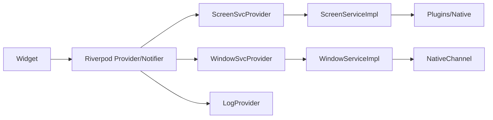

# SERVICES\_AND\_PODS\_DI.md

> Small, interface‑based **service layer** wired with **Riverpod** DI and an injected **logger**.
> Goals: simple, testable, no concept leakage, easy overrides for fakes/mocks.

---

## 1) Layering & Dependency Injection (DI)

**Rule of flow:** `UI → Pods (Riverpod) → Services (interfaces) → Platform/Repos`.
**Never backwards:** services must not depend on providers/widgets; platform/plugin types never cross the service boundary—use domain DTOs.

**Riverpod as the DI container**

* Each dependency (logger, services, repos) has a `Provider` (or `Provider.family`).
* Construction happens in providers; **tests override** these providers with fakes.
* UI and pods only “know” providers, not concrete classes.



---

## 2) Logger (injected everywhere)

### 2.1 Minimal wrapper (keeps it swappable)

```dart
// lib/src/core/logging/app_logger.dart
import 'dart:io';
import 'package:flutter/foundation.dart' show kReleaseMode;
import 'package:logger/logger.dart';

class AppLogger {
  final Logger _inner;
  AppLogger._(this._inner);

  factory AppLogger({String appName = 'macos_taskbar', String? fileName}) {
    final outputs = <LogOutput>[ConsoleOutput()];
    if (kReleaseMode && fileName != null && Platform.isMacOS) {
      final dir = Directory('${Platform.environment['HOME']}/Library/Logs/$appName')..createSync(recursive: true);
      outputs.add(FileOutput(file: File('${dir.path}/$fileName')));
    }
    final printer = kReleaseMode ? SimplePrinter(printTime: true) : PrettyPrinter(methodCount: 0, printTime: true);
    return AppLogger._(Logger(
      level: kReleaseMode ? Level.info : Level.debug,
      filter: ProductionFilter(),
      printer: printer,
      output: MultiOutput(outputs),
    ));
  }

  // tagging support
  AppLogger tag(String tag) => AppLogger._(Logger(
    level: _inner.level,
    filter: _inner.filter,
    printer: PrefixPrinter(_inner.printer!, prefix: '[$tag]'),
    output: _inner.output,
  ));

  // ergonomic shorthands
  void d(String m, [Object? e, StackTrace? s]) => _inner.d(m, e, s);
  void i(String m, [Object? e, StackTrace? s]) => _inner.i(m, e, s);
  void w(String m, [Object? e, StackTrace? s]) => _inner.w(m, e, s);
  void e(String m, [Object? e, StackTrace? s]) => _inner.e(m, e, s);
  void f(String m, [Object? e, StackTrace? s]) => _inner.wtf(m, e, s);
}
```

### 2.2 DI providers for the logger

```dart
// lib/src/bootstrap/logger_providers.dart
import 'package:flutter_riverpod/flutter_riverpod.dart';
import '../core/logging/app_logger.dart';

/// Root logger (override in main/tests to configure sinks/levels)
final loggerRootProvider = Provider<AppLogger>((ref) {
  // Safe default for dev; main() overrides for release file logging.
  return AppLogger(appName: 'macos_taskbar');
});

/// Tagged child logger (feature/service specific)
final loggerProvider = Provider.family<AppLogger, String>((ref, tag) {
  final root = ref.watch(loggerRootProvider);
  return root.tag(tag);
});
```

**Main wires the root logger:**

```dart
// lib/main.dart
import 'dart:async';
import 'package:flutter/material.dart';
import 'package:flutter_riverpod/flutter_riverpod.dart';
import 'src/bootstrap/logger_providers.dart';
import 'src/core/logging/app_logger.dart';
import 'src/app.dart';

void main() {
  final rootLog = AppLogger(appName: 'macos_taskbar', fileName: 'app.log');

  FlutterError.onError = (d) => rootLog.e('FlutterError', d.exception, d.stack);
  PlatformDispatcher.instance.onError = (e, s) { rootLog.e('Uncaught', e, s); return true; };

  runZonedGuarded(
    () => runApp(ProviderScope(
      overrides: [loggerRootProvider.overrideWithValue(rootLog)],
      child: const App(),
    )),
    (e, s) => rootLog.e('ZoneGuard', e, s),
  );
}
```

---

## 3) Service contracts (interfaces) — simple & testable

```dart
// lib/src/core/models/result.dart (Freezed)
import 'package:freezed_annotation/freezed_annotation.dart';
part 'result.freezed.dart';
@freezed sealed class Result<T> with _$Result<T> {
  const factory Result.ok(T value) = _Ok<T>;
  const factory Result.err(String message) = _Err<T>;
}
```

```dart
// lib/src/core/models/display.dart (Freezed)
import 'dart:ui';
import 'package:freezed_annotation/freezed_annotation.dart';
part 'display.freezed.dart'; part 'display.g.dart';
@freezed
class Display with _$Display {
  const factory Display({
    required int id,
    required Rect frame,
    required double scale,
    required bool isPrimary,
    required String name,
  }) = _Display;
  factory Display.fromJson(Map<String, dynamic> json) => _$DisplayFromJson(json);
}
```

```dart
// lib/src/core/services/screen_service.dart
import 'dart:ui';
import '../models/display.dart';
import '../models/result.dart';

abstract class ScreenService {
  Future<Result<List<Display>>> getDisplays();
  Rect barRect(Display d, {double height = 44});
}
```

```dart
// lib/src/core/services/window_service.dart
import 'dart:ui';
import '../models/result.dart';
class WindowEntry {
  final int windowNumber, ownerPid, displayId;
  final String ownerName, title;
  final Rect bounds;
  const WindowEntry(this.windowNumber, this.ownerPid, this.ownerName, this.title, this.bounds, this.displayId);
}
abstract class WindowService {
  Future<Result<List<WindowEntry>>> listWindowsForDisplay(int displayId);
  Future<Result<void>> focus(int windowNumber);
  Future<Result<void>> nudgeAwayFromBar(int windowNumber, int displayId, Rect avoid);
}
```

*(Add other services—Profiles, JumpLists, AppLaunch, Storage—using the same pattern.)*

---

## 4) Implementations with injected logger

### 4.1 ScreenService (macOS)

```dart
// lib/src/core/services_impl/screen_service_macos.dart
import 'dart:ui';
import 'package:screen_retriever/screen_retriever.dart';
import '../models/display.dart';
import '../models/result.dart';
import '../services/screen_service.dart';
import '../../core/logging/app_logger.dart';

class MacScreenService implements ScreenService {
  final AppLogger log;
  MacScreenService({required this.log});

  @override
  Future<Result<List<Display>>> getDisplays() async {
    try {
      final ds = await ScreenRetriever.instance.getAllDisplays();
      final out = ds.map((d) => Display(
        id: d.id,
        frame: Rect.fromLTWH(0, 0, d.size.width, d.size.height),
        scale: d.scaleFactor,
        isPrimary: d.isPrimary,
        name: d.name ?? 'Display ${d.id}',
      )).toList();
      log.i('displays=${out.length}');
      return Result.ok(out);
    } catch (e, s) {
      log.e('getDisplays failed', e, s);
      return const Result.err('screen plugin error');
    }
  }

  @override
  Rect barRect(Display d, {double height = 44}) =>
      Rect.fromLTWH(d.frame.left, d.frame.bottom - height, d.frame.width, height);
}
```

### 4.2 WindowService (native channel)

```dart
// lib/src/core/services_impl/window_service_impl.dart
import 'dart:ui';
import '../../platform/native_channel.dart' as bridge; // your MethodChannel wrapper
import '../models/result.dart';
import '../services/window_service.dart';
import '../../core/logging/app_logger.dart';

class WindowServiceImpl implements WindowService {
  final AppLogger log;
  WindowServiceImpl({required this.log});

  @override
  Future<Result<List<WindowEntry>>> listWindowsForDisplay(int displayId) async {
    try {
      final rows = await bridge.Native.listWindowsForDisplay(displayId);
      final mapped = rows.map((w) =>
        WindowEntry(w.windowNumber, w.ownerPid, w.ownerName, w.title, w.bounds, w.displayId)).toList();
      log.d('listWindows d=$displayId -> ${mapped.length}');
      return Result.ok(mapped);
    } catch (e, s) {
      log.e('listWindowsForDisplay failed', e, s);
      return const Result.err('bridge error');
    }
  }

  @override
  Future<Result<void>> focus(int windowNumber) async {
    try { await bridge.Native.focusWindow(windowNumber); return const Result.ok(null); }
    catch (e, s) { log.e('focus failed', e, s); return const Result.err('bridge error'); }
  }

  @override
  Future<Result<void>> nudgeAwayFromBar(int windowNumber, int displayId, Rect avoid) async {
    try {
      await bridge.Native.moveWindowAvoidingBar(windowNumber, displayId, {
        'x': avoid.left, 'y': avoid.top, 'w': avoid.width, 'h': avoid.height
      });
      return const Result.ok(null);
    } catch (e, s) {
      log.e('nudge failed', e, s);
      return const Result.err('bridge error');
    }
  }
}
```

---

## 5) Service providers (DI wiring)

```dart
// lib/src/bootstrap/service_providers.dart
import 'package:flutter_riverpod/flutter_riverpod.dart';
import '../core/logging/app_logger.dart';
import 'logger_providers.dart';
import '../core/services/screen_service.dart';
import '../core/services_impl/screen_service_macos.dart';
import '../core/services/window_service.dart';
import '../core/services_impl/window_service_impl.dart';

// Inject logger into each service via providers:

final screenServiceProvider = Provider<ScreenService>((ref) {
  final log = ref.watch(loggerProvider('ScreenService'));
  return MacScreenService(log: log);
});

final windowServiceProvider = Provider<WindowService>((ref) {
  final log = ref.watch(loggerProvider('WindowService'));
  return WindowServiceImpl(log: log);
});

// Add: profileServiceProvider, jumpListServiceProvider, appLaunchServiceProvider, etc.
```

---

## 6) Pods (providers) calling services (and nothing else)

**Displays (FutureProvider)**

```dart
// lib/src/features/displays/pods/displays_pod.dart
import 'package:flutter_riverpod/flutter_riverpod.dart';
import '../../../bootstrap/service_providers.dart';
import '../../../bootstrap/logger_providers.dart';
import '../../../core/models/display.dart';
import '../../../core/models/result.dart';

final displaysPod = FutureProvider<List<Display>>((ref) async {
  final log = ref.watch(loggerProvider('DisplaysPod'));
  final svc = ref.watch(screenServiceProvider);
  final res = await svc.getDisplays();
  return res.when(
    ok: (list) {
      log.d('got ${list.length} displays');
      return list;
    },
    err: (msg) {
      log.w('failed: $msg');
      throw StateError('Displays error: $msg');
    },
  );
});
```

**Windows (family provider per display)**

```dart
// lib/src/features/windows/pods/windows_pod.dart
import 'package:flutter_riverpod/flutter_riverpod.dart';
import '../../../bootstrap/service_providers.dart';
import '../../../bootstrap/logger_providers.dart';
import '../../../core/models/result.dart';
import '../../../core/services/window_service.dart';

final windowsForDisplayPod = FutureProvider.family<List<WindowEntry>, int>((ref, displayId) async {
  final log = ref.watch(loggerProvider('WindowsPod($displayId)'));
  final svc = ref.watch(windowServiceProvider);
  final res = await svc.listWindowsForDisplay(displayId);
  return res.when(
    ok: (list) => list,
    err: (msg) { log.w('error: $msg'); throw StateError('Windows error: $msg'); },
  );
});
```

> Pods neither know nor care about MethodChannels or plugins. They only call services and log via the injected logger.

---

## 7) Fakes & test injection

**Fake service (e.g., 10 screens)**

```dart
// lib/src/core/services_fake/screen_service_fake.dart
import 'dart:ui';
import '../models/result.dart';
import '../models/display.dart';
import '../services/screen_service.dart';

class ScreenServiceFake implements ScreenService {
  final List<Display> _displays;
  ScreenServiceFake({int count = 2, Size size = const Size(1920,1080)})
      : _displays = List.generate(count, (i) => Display(
          id: i+1,
          frame: Rect.fromLTWH(size.width * i, 0, size.width, size.height),
          scale: 2.0, isPrimary: i==0, name: 'Fake $i'));

  @override Future<Result<List<Display>>> getDisplays() async => Result.ok(_displays);
  @override Rect barRect(Display d, {double height = 44}) =>
      Rect.fromLTWH(d.frame.left, d.frame.bottom - height, d.frame.width, height);
}
```

**Test: override providers**

```dart
// test/displays_pod_test.dart
import 'package:flutter_test/flutter_test.dart';
import 'package:flutter_riverpod/flutter_riverpod.dart';
import 'package:macos_taskbar/src/features/displays/pods/displays_pod.dart';
import 'package:macos_taskbar/src/bootstrap/service_providers.dart';
import 'package:macos_taskbar/src/bootstrap/logger_providers.dart';
import 'package:macos_taskbar/src/core/logging/app_logger.dart';
import 'package:macos_taskbar/src/core/services_fake/screen_service_fake.dart';

void main() {
  test('handles 10 screens with DI', () async {
    final container = ProviderContainer(overrides: [
      // quiet logger
      loggerRootProvider.overrideWithValue(AppLogger(appName: 'test')),
      // fake service
      screenServiceProvider.overrideWithValue(ScreenServiceFake(count: 10)),
    ]);
    addTearDown(container.dispose);

    final displays = await container.read(displaysPod.future);
    expect(displays.length, 10);
  });
}
```

> For other tests, override `windowServiceProvider`, `profileServiceProvider`, etc., with fakes/mocks.

---

## 8) Creating a new service (recipe)

1. Define a **small interface** in `core/services/YourService.dart`.
2. Implement it in `core/services_impl/YourService_impl.dart` with a `AppLogger log` param and any concrete deps.
3. Add a **provider** in `bootstrap/service_providers.dart`:

   ```dart
   final yourServiceProvider = Provider<YourService>((ref) {
     final log = ref.watch(loggerProvider('YourService'));
     return YourServiceImpl(log: log /*, other deps from providers */);
   });
   ```
4. In a pod, `final svc = ref.watch(yourServiceProvider);` and call it.
5. For tests, `overrideWithValue(YourServiceFake(...))`.

Keep methods few and purposeful. If the interface wants >8–10 methods, split it.

---

## 9) “No concept leakage” checklist

* ✅ **No plugin/native types** (`NSScreen`, `CGWindowID`, `MethodChannel`) in service signatures.
* ✅ Services return **domain DTOs** (`Display`, `WindowEntry`) and `Result<T>`.
* ✅ **Pods never** call plugins or the native bridge directly.
* ✅ **Logging is injected**; services log internally; pods log high‑level events.
* ✅ Tests swap services via **Provider overrides**; no global singletons.

---

## 10) Quick wiring in `App` (end‑to‑end)

```dart
// lib/src/app.dart
import 'package:flutter/material.dart';
import 'package:flutter_riverpod/flutter_riverpod.dart';
import 'features/displays/pods/displays_pod.dart';

class App extends ConsumerWidget {
  const App({super.key});

  @override
  Widget build(BuildContext context, WidgetRef ref) {
    final displays = ref.watch(displaysPod);
    return MaterialApp(
      debugShowCheckedModeBanner: false,
      home: Scaffold(
        body: displays.when(
          data: (list) => Center(child: Text('Displays: ${list.length}')),
          loading: () => const Center(child: CircularProgressIndicator()),
          error: (e, _) => Center(child: Text('Error: $e')),
        ),
      ),
    );
  }
}
```

---

## 11) Keep it simple

* One concept → one interface.
* Inject the **logger** and only the deps you truly need.
* Prefer **Result<T>** over throwing across layers.
* Start with **ScreenService** and **WindowService**; add others as features land.
* Use **provider overrides** for all testing scenarios (e.g., “10 screens”).

*End.*
